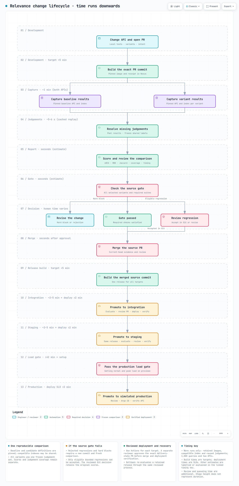

# Build, promote and roll back a release

Develop the Search API in `delivery-source`. Actions builds it and the coordinator
compares its results with the baseline. After source merge, promote the new build
through integration, staging and simulated production. Argo CD deploys reviewed
state; the coordinator checks the image, index and public API.

The lab's remote workflow is installed; see [current status](plans/roadmap.md)
for remaining validation. Developers do not need a kubeconfig. Operators install and repair
the lab using [control runtime](control-runtime.md).

## Relevance change lifecycle

[Open the interactive timeline](diagrams/interactive/relevance-sdlc.html).
Each promotion follows its own evidence gate. Integration and staging use short
performance probes; simulated production requires the normal/peak load check,
then compares its active API with the prepared candidate before the route switch.
Read from top to bottom; spacing shows sequence, not elapsed time.
Stage timings cover warm runs only, with reused judgements and a compatible index.
Review and queueing time are additional. See the [timing sources and boundaries](plans/relevance-sdlc-diagram.md#timing-sources-and-boundaries).
The source gate checks the PR commit. Deployment uses a separate build of the
merged commit, promoted unchanged through three reviewed targets.

## Make and evaluate a change

1. In `delivery-source`, create a branch, change the API or ranking settings and
   run its application tests. The [source contributors guide](../lab/delivery/bootstrap/README.md#contributors-guide)
   includes a copyable query rewrite and test.
2. Declare variants and intent in `gate/selection.json`. Use `ranking-change`
   for intentional changes, or `preserve-results` for a release expected to
   return the same products in the same order. `gate/evaluation.json` names the
   baseline and default; `configurations/` contains their settings.
   Fresh repositories select `ranker-a` with `preserve-results`. If the selection
   file is absent in an older repository, create it using the example in the
   [source gate guide](../lab/delivery/bootstrap/gate/README.md#prepare-your-pr)
   and commit it on your PR branch before pushing.
3. Push and open a PR. **Reference release CI** builds its exact commit and stores
   the image, bundle and receipt in Nexus. **Offline relevance gate** submits
   a comparison; its completion alone is not a relevance verdict.
4. Open the PR comment's storefront and report links. Review relevance, label
   coverage and changed results using the [variant guide](variant-evaluation.md).
   Add report-only queries for your change, or explicitly require a labelled set.
5. Wait for `relevance-lab/merge-gate` on the current head. Every new commit needs
   fresh evidence. A bounded exception uses the [Git decision procedure](variant-evaluation.md#accept-a-bounded-regression) without changing
   scores; invalid evidence and hard blocks cannot be approved away.
6. Merge when the required checks pass. CI builds the merged commit separately.
   Use that successful run for deployment, rather than the PR-head build.

Changes confined to the two source README paths receive the
[documentation exemption](relevance-gate.md); tests and builds still run.
Source repositories default to no required approvals for the lab, while setup
preserves stricter existing rules. Deployment proposals require a separate reviewer.

## Follow a release

Open [Release dashboard](https://control.localhost:34443/release-dashboard) and
sign in with your lab identity. Search or filter the release cards, then choose
**View release tree**. The selected build URL can be bookmarked or shared with
another authorised lab user.

The tree follows source merge through Integration, Staging, the inactive
production candidate and active production. Attached records show the source
gate at merge, build outcome, saved check results, current proposal review and
deployment verification. **Merged** means the proposal merged; **Verified**
means its exact release has a matching deployment receipt and ready rollout.
**Prepared** means the inactive production slot is ready. It does not switch
the active route. **Previously verified** identifies a historical deployment.

Use **Inputs & policy** for pinned inputs and the source gate configuration;
**Activity** shows attempts, durations and progress links. The current active
production release is shown alongside the selected release. The page refreshes
every 30 seconds while visible. Refreshing reads records without starting work
or extending leases. Administrators can submit the named operations below;
readers see the same tree with unavailable controls and an explanation.

### Promote from the release tree

1. Select the successful merged-source build. Choose an environment node in the
   tree, or use **Stage** in **Promotion controls**.
2. Choose **Change intent**, then **Check and propose Integration** or
   **Check and propose Staging**. Staging requires this exact release to be
   currently verified in Integration. Follow **Open progress and review links**.
3. Review the proposal and retained check report in Gitea. Approve the exact PR
   head. Select it under **Approved proposal**, then choose **Deploy approved
   proposal**. The coordinator rechecks the approval and evidence, merges the
   desired state, waits for Argo CD and verifies the API.
4. After verified Staging, select **Production candidate** and choose **Prepare
   production candidate**. Approve and deploy its preparation proposal using
   the same controls. Active production continues serving its current release.
5. Select **Active production**, then **Check and request production release**.
   This runs the normal and peak load gate and the final comparison against
   active production. Review, approve and deploy the route-switch proposal.
6. For rollback, choose **Check and request rollback** on the active release.
   A different, ready and previously verified release must exist in the other
   slot. Review and deploy the rollback proposal separately.

The panel pins the selected build and observed environment definitions. If a
release, target or reviewed head changes before queued work executes, the
operation fails with a refresh instruction; it cannot silently deploy a different
release. Retrying the same submission retains its durable operation. After a
failed or interrupted operation, inspect its progress before choosing **Submit a
new attempt**. The existing Actions workflows and production release page remain
available.

**Customise the next comparison** links to the selected source commit’s variants,
query-set selection and gate policy. These inputs are frozen for this release.
Edit the source and build a new release to change them. The panel supports intent
selection; it does not provide an arbitrary workflow or shell editor.

Unknown records are shown explicitly. The dashboard reads recent source runs
and operations plus retained verification history; it is not a complete archive
of every source PR. Older production checks without a recorded release identity
appear separately. A missing gate record does not imply a passing gate.

## Preview or compare manually

The **Environments** view shows each delivery environment's next promotion:
previews to Integration, Integration to Staging, and Staging or the inactive
production slot to active Production. **Ready** describes a serving API;
the promotion badge describes the evidence and review for that next move.

| Badge | Meaning |
| --- | --- |
| Grey | No matching evidence, unavailable evidence, an already deployed release, or unknown source order |
| Red | Recorded promotion checks are incomplete, approval is pending, or the proposal or target changed |
| Orange | The reviewed release is promotable, but its source commit predates the target |
| Green | The reviewed release is promotable and its source commit follows the target |

Version order uses Git ancestry from retained source history. Release IDs and
build numbers identify exact builds; tags do not define their order. Rebuilds
of the same commit and unrelated or unavailable history stay neutral. This
read-only status does not replace the coordinator's deployment checks. A
passing source gate alone does not satisfy a subsequent promotion gate.
Production preparation alone does not satisfy the final release gate.

To end a preview or ephemeral environment before its lease expires, choose
**Expire now** on its card and confirm. Ephemeral environments use the normal
deletion path. Delivery preview expiry requires a human lab administrator,
is queued through the coordinator and shows **Follow expiry progress** beside
the button. The expiry operation ends the lease; the normal cleanup loop then
removes the deployment. A running comparison blocks early expiry, and a
changed preview lease requires you to refresh before trying again.

Reports and the shared catalogue are retained. Integration, Staging and both
Production slots have no expiry control and are rejected by the preview expiry
API. Use the reviewed deployment or rollback workflow to change them.

In `delivery-source` → **Actions**, choose **Create preview** or **Compare builds**,
then **Run workflow** on **main**. Supply the successful build run ID
from its `/actions/runs/<id>` URL; compare also needs a baseline run.

The workflow prints a durable progress URL and releases the runner. Follow that
record to completion and open the returned storefront or report. Browser links
show a readable progress page with the current stage and outcome. Report pages separate relevance,
result overlap and judgement coverage. The recorded merge gate appears at the
top; a passed gate needs no relevance decision. The PR offers a decision link only
when a bounded decision is required. An old decision link for a passed gate
also shows that no decision is needed. Timings distinguish elapsed time since
submission (including waiting) from each search capture Job. Capture requests
are functional checks; their retry counts do not constitute a load test. Gatling
reports show workload duration, latency, failed requests and phase budgets.
Promotion and rollback progress pages link to all three retained checks. After
deployment, the verification report shows the release, index, products checked
and verification duration. RBO and Jaccard compare each variant with
the baseline; relevance scores are shown per variant. Delivery evidence links to each
retained check. Use **View JSON data** for the underlying record. **Submitted**
does not mean evaluated or deployed. Both comparison revisions must contain the
current evaluation/configuration contract.

For workstation commands and retry behaviour, see [remote delivery](remote-delivery.md).
Both paths call the same coordinator; neither requires kubectl.

## Promote a merged release

The three targets share one cluster. They are separate deployment namespaces,
not separate failure domains or performance-isolated systems.

1. Run **Promote to integration** on **main**. Enter the successful merged-source
   build number and change intent. The lab uses `esci-gb-v1`.
2. Follow the operation to its `delivery-state` PR. The coordinator first
   evaluates the candidate against the target, then proposes the pinned release.
   A failed evaluation cannot create a valid promotion.
3. Review the evidence and wait for `delivery/validation`. A permitted reviewer
   must approve the exact PR head. Approval does not deploy it.
4. Run **Deploy approved promotion** with that **desired-state PR number**.
   The coordinator rechecks the proposal and approval, merges it, then waits for
   Argo CD and the public API. The operation must finish with `state: verified`.
5. Run **Promote to staging**, then repeat review and deployment using the
   **same merged build** and frozen inputs.
   Each preceding target must be verified first. No image is rebuilt.
6. Use the [production release UI](https://control.localhost:34443/production-release)
   for the final release, as described below.

If desired-state main or the target baseline changes, create a fresh proposal.
Evidence must match the exact inputs and intent and be no more than three days old.
A merge without successful deployment verification is not a completed promotion.
Use `verify` with the target to recheck after an operator repairs a failed deployment.

| Target | Gatling profile | Required evidence |
| --- | --- | --- |
| Integration / staging | `probe` | Short wiring/regression check |
| Simulated production | `production-load` | One minute warmup, five minutes at 10 requests/s and fifteen minutes at 20 requests/s, for each release |

The production **load gate** runs sequentially against temporary baseline/candidate
previews. The additional final relevance check calls the active production API
and prepared candidate slot directly. The two load runs take at least 42 minutes
plus setup; the final relevance check adds capture, resolution and scoring time.
Both runs must complete every scheduled arrival and satisfy the pinned
[workload](../lab/traffic/production-load-v1.json). Normal-load budgets are
p95 ≤250 ms and p99 ≤500 ms; peak budgets are p95 ≤400 ms and p99 ≤800 ms.
Both phases require fewer than 1% failed requests. These are lab thresholds,
not production capacity claims. Probes, smoke checks and stress tests cannot
replace this gate. Validation checks the load evidence again before merge.

## Release to production

Blue–green deployment keeps two API releases available. The production URL
selects one slot; preparing the other slot does not change that route.

1. Open **Production release** from the control UI. Compare active production
   with the prepared candidate: build, source commit, image, catalogue and index.
   Candidate values stay blank until preparation is deployed. Select **Prepare
   production candidate** to use the verified staging release. If staging matches
   active production, promote a different release to staging first.
2. Follow the operation to its preparation PR. Approve the exact head in Gitea,
   then select it under **Deploy an approved PR**. Only open production PRs
   approved at their current commit appear; use **Refresh status** after approval.
3. Select the change intent and **Check and release production**. The coordinator
   runs the existing full gates, including normal/peak Gatling load. It then
   compares the active production API with the prepared candidate.
4. Open the final production comparison from the friendly report. Check nDCG,
   its change and significance, RBO/Jaccard, coverage and judgement resolution
   outcomes. Both releases use one frozen set of labels.
5. Review and approve the route-switch PR in Gitea. Use **Deploy an approved PR**
   and select that approved PR. Wait for deployment verification and open active production.

The final check uses up to 1,000 queries from the pinned ESCI suite as a
**simulated recent-traffic fixture**. It does not claim to reproduce yesterday's
traffic. The baseline calls the stable active service; the candidate calls its
separate slot service. Their catalogue, concrete index, mapping and request
context must match. Elasticsearch's write block represents paused catalogue
updates and is checked before and after evaluation and before activation.

The final report adds human-reviewed evidence; it does not introduce a new nDCG
threshold or qualify model predictions. Missing scores, abstentions and errors
remain visible. Existing delivery gates still apply. Changed slots or stale
final evidence require a fresh check. Both slots remain deployed after switching.

Use **Request rollback to the other slot** to re-evaluate the retained release
and create a reviewed rollback PR. A subsequent candidate preparation replaces
that inactive slot, so the one-step retained rollback covers the last switch.
Older releases remain in Git history and can use the separate historical restore
workflow.

## Roll back

For production, use **Request rollback to the other slot** in the release UI.
The Actions steps below apply to integration and staging.

1. Find the previous verified fingerprint under
   `delivery-state/history/<target>/`. Its retained definition pins the old
   image, configuration, inputs and index recipe.
2. Run **Request rollback** with the target, fingerprint and intent.
   The coordinator evaluates **current → previous** and creates a new PR.
   Reversing an old report is insufficient. Production rollback uses the full
   `production-load` profile too.
3. Review, approve and run `merge-reviewed` as for promotion. A historical schema
   uses its retained index recipe; it cannot silently use the latest mapping.

## Artefacts and administration

| Repository or store | Contents |
| --- | --- |
| `delivery-source` | API/UI, tests, ranking settings, index contract and Actions workflows |
| `delivery-state` | Reviewed target definitions, relevance decisions, proposals and deployment history |
| Nexus | Digest-pinned images, deterministic bundles, build receipts and signed merge evidence |
| `search-spike` / `environment-state` | Separate leased experiment workflow in the control UI |

Operators bootstrap empty targets, install the coordinator, manage credentials
and recover failed resources. See [control runtime](control-runtime.md) and
[activation](plans/walkthrough-activation.md). Previews expire after 72 hours;
stable targets do not. Removing a preview retains its source and frozen evidence.

For GitHub Enterprise, retain the shared Actions syntax and frozen contracts,
replace provider-specific repository/run/PR/status calls, and configure runner
credentials and protection. Local Gitea execution does not establish GHES compatibility.
See [dated delivery evidence](research/evidence/promotion-deployment.md) and
[remaining native/cloud checks](plans/native-cloud-validation.md).

## Follow queued and running work

The production release page lists queued and active delivery work. Submission
feedback appears beside the button used. Repeated candidate preparation for the
same verified staging release and active production reuses its operation and PR,
including from another browser tab. Refresh before preparing a changed release.

The progress page shows the queue position and the active blocker. Expand
**Live logs** for timestamped steps and operation results. **Pause** stops log
updates and scrolling; **Resume** continues from the same cursor. Only bounded,
operation-scoped messages are shown; raw subprocess output is kept out of this
view. Missing logs do not prevent status or report access.

During a Gatling check, live driver counters show the side, phase, completed
requests, failures and mean latency. These are provisional. Job elapsed time
includes startup; planned traffic time does not. The retained report supplies
the gate's workload validity, percentiles and outcome. A failed check links its
evidence and identifies a missed side, phase and threshold when available.
An incomplete driver run cannot satisfy the gate.

Humans approve delivery-state PRs but cannot directly merge them. Use **Deploy
approved promotion** or the production release UI. Only the coordinator may
merge to delivery-state main after revalidation; source PRs use normal merging.

The live Gatling panel links to SigNoz with the tested search environment and
the sampled run interval selected. Search panels use that environment filter;
operation panels remain lab-wide. Apply the reviewed dashboard definition when
activating this batch. No data is not evidence that a check passed.
