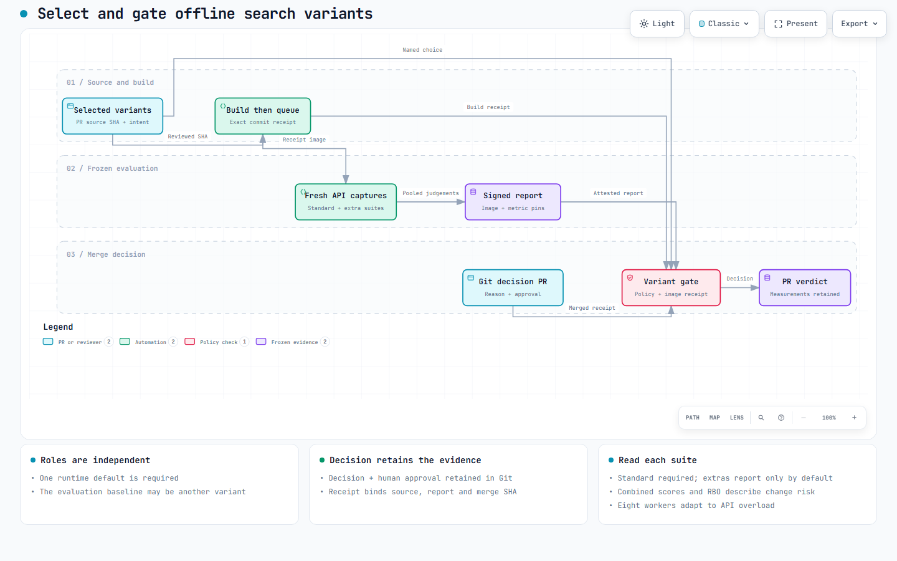
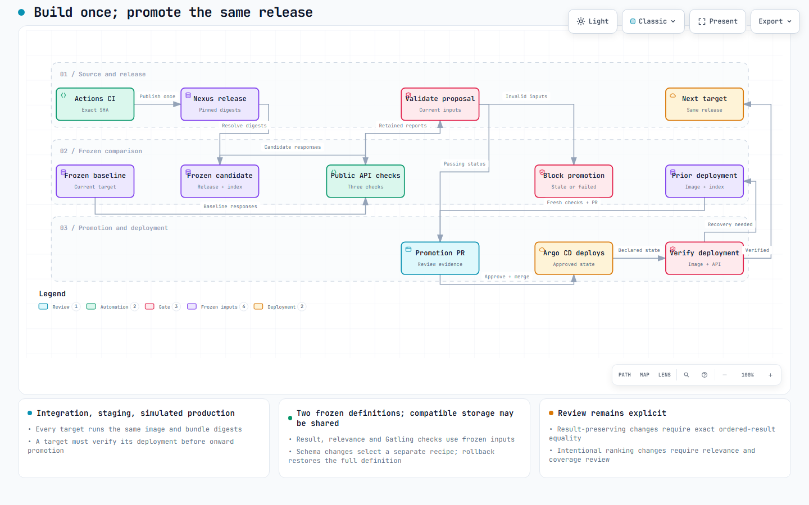

# Build, promote and roll back a release

CI builds the exact Search API revision and publishes it to Nexus. A source PR needs its own merge evidence. After source merge, promotion deploys the **merged-source release** through reviewed desired-state changes; Argo CD applies them and the coordinator verifies the serving API.



## Choose the workflow

| Repository/service | Use |
| --- | --- |
| [delivery-source](https://gitea.localhost:34443/elastic-agent/delivery-source) | API/UI, tests, chart, index contract and shared Actions workflows |
| [delivery-state](https://gitea.localhost:34443/elastic-agent/delivery-state) | Reviewed deployment/promotion definitions |
| Nexus | Images, bundles, receipts and signed gate evidence |
| `search-spike` / `environment-state` | Leased lab comparisons; distinct from release promotion |

**Engineer:** change source and declare variants/intent. **Operator:** capture frozen evidence and propose deployment. **Reviewer:** decide on source acceptance, bounded exceptions and promotion. The watcher validates and verifies; it does not approve or merge PRs.

Operator setup is `python lab/setup_nexus.py`, then `python lab/setup_delivery.py`, from the repository root after platform, HTTPS and frozen-input bootstrap. Setup seeds source once and creates the trusted local runner. Repeated source edits use PRs. Its privileged build runner is for trusted contributors, not arbitrary public fork code.

## Build and evaluate a source PR

1. Open a branch and PR in `delivery-source`.
2. Commit `gate/selection.json` naming release candidates and `preserve-results` or `ranking-change` intent. Choose one default; the metric baseline may differ.
3. Wait for **Reference release CI** to test and build the exact head. It publishes multi-platform images, the deterministic bundle, release descriptor and build receipt, in that order. A failed build does not publish a successful receipt.
4. Ask the operator to follow [capture and evidence publication](evaluation-runbook.md) for that exact image/commit. Inspect [scores, coverage and gate outcomes](variant-evaluation.md).
5. Rerun **Offline relevance gate** on the same commit. Missing, stale, blocked or mismatched evidence fails. A recorded bounded exception preserves the score and reason; it does not alter the result.
6. Review and merge when the required checks pass. CI builds that merged SHA separately; promotion uses this new release and matching evidence.

Changes confined to the two source README paths have a [recorded relevance exemption](relevance-gate.md); application checks still run. Source gate approval does not deploy anything.

| Retained artefact | Identity |
| --- | --- |
| `releases/<release-id>.json` | Source revision, image, bundle, file hashes and index compatibility |
| `bundles/<sha256>.tar.gz` | Deterministic source, chart and index/indexer contract |
| `builds/<source-sha>/<run>-<attempt>.json` | Exact provider build attempt; published last |
| Image | Digest-pinned API/UI/query code and source revision |

Verification checks bundle paths/checksums and rejects mutable images or incompatible indexers. Credentials, namespace and dataset selection belong to the deployment, not the release bundle.

## Open a source PR preview

An operator can deploy a successful PR build before source merge. Use PowerShell
from the lab repository root, with `lab-control` installed and the
[workstation access setup](preview-access.md) complete:

```powershell
$env:LAB_STATE_DIR = (Resolve-Path .lab).Path
$kubeconfig = Join-Path $env:LAB_STATE_DIR kubeconfig.yaml
$previewRun = Read-Host 'Successful Reference release CI run ID from the delivery-source Actions URL'
$preview = kubectl --kubeconfig $kubeconfig -n lab-control exec deployment/lab-control -c api -- python lab/delivery_cli.py preview --run $previewRun --dataset esci-gb-v1 --variant-config lab/delivery/configurations/ranker-a.json | ConvertFrom-Json
'https://{0}.preview.relevance.test:34443/' -f $preview.name
```

Use the numeric ID in `/actions/runs/<id>`, not the displayed run sequence or PR
number. A successful command returns `state: ready`, the exact source revision
and a frozen environment fingerprint. Open the printed URL and try the change.
The preview expires after 72 hours.

The example configuration names `ranker-a` as the default with the API's standard
field boosts. Supply another JSON file to freeze other named variants. Use
`lab/delivery/configurations/ranker-baseline.json` for a baseline preview with
the same boosts. Both previews can reuse a compatible frozen index.

Preview creation verifies the build receipt, image, bundle and frozen inputs.
It does not publish comparison evidence or pass the relevance gate. If the build
failed or its index contract is incompatible, fix that before retrying. Follow
the [evaluation runbook](evaluation-runbook.md) to compare the two APIs.
Promotion still requires a separate successful build of the merged source.

## Evaluate and propose deployment



Integration, staging and simulated production are local namespaces sharing one cluster. They are not separate failure domains or performance-isolated environments.

Use PowerShell from the repository root with installed `lab-control`. Commands execute in the authoritative Pod, which owns checkout and evidence files.

```powershell
$env:LAB_STATE_DIR = (Resolve-Path .lab).Path
$kubeconfig = Join-Path $env:LAB_STATE_DIR kubeconfig.yaml
kubectl --kubeconfig $kubeconfig -n lab-control exec deployment/lab-control -c api -- python lab/delivery_cli.py status
$candidateRun = Read-Host 'Successful merged-source push build run ID from delivery-source Actions'
$dataset = 'esci-gb-v1'
$recipe = Read-Host 'Compatible retained index recipe SHA-256'
$intent = 'preserve-results'
```

Get the recipe from the retained environment/deployment definition; [index recovery](index-recovery.md) explains its identity. Check `contracts/index.json` in the release for compatibility. Use `ranking-change` only when changed results are intentional, in evaluation and proposal alike. A PR number or PR-head build cannot replace the merged-source run.

For a **new** demonstration without changed targets, initialise them once:

```powershell
kubectl --kubeconfig $kubeconfig -n lab-control exec deployment/lab-control -c api -- python lab/delivery_cli.py bootstrap --run $candidateRun --dataset $dataset --recipe $recipe
```

Do not use bootstrap to overwrite an already promoted target.

```powershell
kubectl --kubeconfig $kubeconfig -n lab-control exec deployment/lab-control -c api -- python lab/delivery_cli.py evaluate-target integration --run $candidateRun --dataset $dataset --recipe $recipe --intent $intent
$evidence = Read-Host 'reference_file printed by evaluate-target (path inside the Pod)'
kubectl --kubeconfig $kubeconfig -n lab-control exec deployment/lab-control -c api -- python lab/delivery_cli.py promote integration --run $candidateRun --dataset $dataset --recipe $recipe --evidence $evidence --intent $intent
```

Evaluation captures the current target as baseline and the proposed release as candidate. It uses the same selected frozen query/label set and a sequential paired Gatling workload. Failed evaluations retain evidence but cannot pass validation. The default `probe` checks wiring; use `--profile smoke` for the five-minute load check.

For another published suite, pass the same `--query-manifest` and `--judgement-manifest` hashes to evaluation and proposal. Blank values select pinned defaults. Reports must match both deployment fingerprints, inputs and intent and be at most three days old. Re-evaluate if any of those change.

## Review, merge and verify

| State | Meaning / next action |
| --- | --- |
| Proposed | Inspect the returned `delivery-state` PR and its frozen evidence |
| Validated | `delivery/validation` passes for exact head/current main |
| Approved | Permitted reviewer approves that head |
| Deploying | Reviewed state is merged; Argo reconciles it |
| Verified | Rollout, image/index fingerprint and public API check agree |

After human approval:

```powershell
$promotionPr = Read-Host 'Approved delivery-state PR number'
kubectl --kubeconfig $kubeconfig -n lab-control exec deployment/lab-control -c api -- python lab/delivery_cli.py merge-reviewed $promotionPr
kubectl --kubeconfig $kubeconfig -n lab-control exec deployment/lab-control -c api -- python lab/delivery_cli.py verify integration
```

A moved desired-state main invalidates the proposal; recreate it. Failed verification is not success merely because merge completed. Inspect coordinator/Argo errors and retry verification after fixing the deployment.

Once integration verifies, repeat target evaluation/proposal for `staging`, then `production`, using the **same** release, dataset and recipe. Reuse evidence only when that target's baseline matches and evidence remains fresh. Promotion performs no image rebuild.

## Roll back a target

Select the previous verified fingerprint from `delivery-state/history/<target>/`. Rollback needs fresh evidence in the direction **current → previous**; reversing an old report is insufficient.

```powershell
$previous = Read-Host 'Previous verified production fingerprint from retained history'
kubectl --kubeconfig $kubeconfig -n lab-control exec deployment/lab-control -c api -- python lab/delivery_cli.py evaluate-target production --fingerprint $previous --intent $intent
$reverseEvidence = Read-Host 'reference_file from this rollback evaluation'
kubectl --kubeconfig $kubeconfig -n lab-control exec deployment/lab-control -c api -- python lab/delivery_cli.py rollback production --fingerprint $previous --evidence $reverseEvidence --intent $intent
```

Review and merge the resulting PR by the same procedure. Its complete retained definition supplies the old image, configuration, inputs and recipe. A schema change creates/restores that recipe's index; it never substitutes the latest mapping.

## Operate and migrate

- Inspect the automatic watcher with `kubectl --kubeconfig $kubeconfig -n lab-control logs deployment/lab-control -c delivery-watcher --tail=30`.
- A preview has a 72-hour lease; stable targets do not. Use `preview`, `delete-preview` and `expire-previews` via the Pod CLI. Source, reports, images and frozen indices survive preview removal.
- Open a preview or stable target at `https://<namespace>.preview.relevance.test:34443/` after the [one-off workstation setup](preview-access.md). No port forward is needed.
- A concurrent operation may require retry: the local coordinator has one writer. Export [control state](control-runtime.md#back-up-and-restore-control-state) and back up retained services separately.
- Historical target NetworkPolicies may need installer-owned ingress reconciliation after cluster restoration. Follow the control update procedure; changing chart source does not rewrite an unchanged frozen bundle.
- The host-only `demonstrate-merge` harness uses a separate, explicitly simulated reviewer. It is not a human release decision and is not part of ordinary promotion.

GHES migration retains standard Actions syntax, build scripts, Nexus artefacts and frozen contracts. Replace provider-specific repository/run/PR/status calls and configure equivalent branch protection. Validate runner labels, check names, credentials and trusted-target behaviour on the actual GHES installation. Local Gitea execution does not prove GHES compatibility.

[Dated delivery evidence](research/evidence/promotion-deployment.md) retains negative cases and measurements. [The delivery plan](plans/reference-ci-cd.md) owns constraints; [native/cloud validation](plans/native-cloud-validation.md) records remaining external checks.
