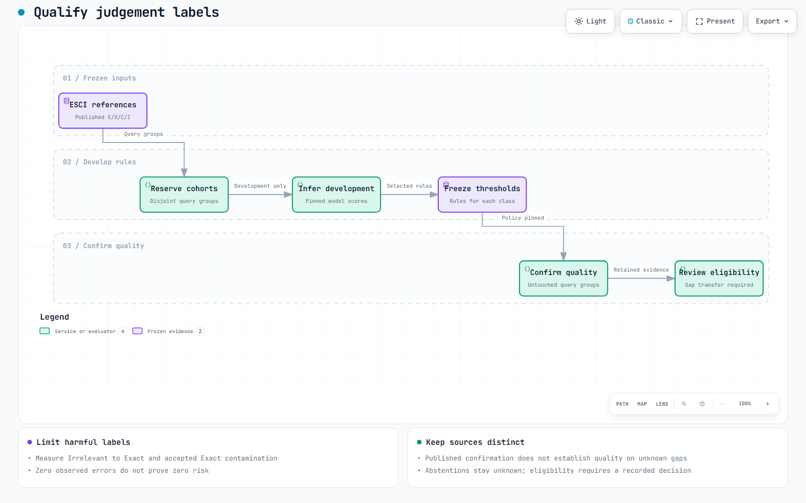

# Check model label quality

Measure a candidate's accepted ESCI labels before allowing it to supply merge-gate
judgements. Numerical serving checks establish repeatability; this workflow checks
whether accepted labels agree with independent references.
[Qualification workflow](diagrams/interactive/label-qualification.html) · [Editable source](diagrams/archify/label-qualification.json)




## Freeze the assessment

The data producer supplies two separate cohorts:

| Cohort | Reference labels | What it checks |
| --- | --- | --- |
| Published | Existing ESCI assessments on locally unused query groups | Agreement with published labels |
| Human gap | Independently assigned labels on retrieved products without published labels | Quality on the gaps the lab needs to fill |

Keep reference labels out of inference inputs. Human reviewers must not see the
candidate's predictions. A published-label result cannot establish gap accuracy.
Public ESCI may have appeared in upstream pretraining; the audit establishes
independence from recorded local training and assessments only.

1. Audit normalised query overlap with training, mapping fit/tuning, earlier
   assessment and reserved research queries. An incomplete audit stops inference.
2. Select whole queries deterministically, then select their product pairs.
   Freeze membership before opening reference labels or predictions. Reserve the
   selected groups separately from existing research protocols.
3. Pin the registered model, release, runtime image, acceptance policy and quality
   criteria. Use separate development queries to select thresholds. A model or
   threshold change requires a new, untouched confirmation cohort.
4. Obtain independent reference labels. Keep published and human-gap results
   separate. Preserve missing human labels as unfinished work.

| Frozen file | Contract |
| --- | --- |
| `inputs.jsonl` | Original query, product and market context; pair IDs and normalised `query_key`; no reference labels |
| `references.jsonl` | One ESCI `label` per pair; `provenance.kind` is `published` or `human`, with the pinned `source_id` |
| `audit.json` | `esci-query-independence-audit`, completed audit, `nfkc_html_whitespace_v1` and excluded query hashes |
| `reservation.json` | Independently verified reservation receipt; retain its original bytes |
| `quality-policy.json` | Frozen copy of `evaluation/specs/esci-label-quality-v1.json` |
| `manifest.json` | `esci-label-quality-cohort`; exact file hashes, query membership, source/model/release/runtime identities and confirmed reservation |

The manifest names its cohort as `published` or `human-gap`. It pins
`inputs_sha256`, `references_sha256`, `audit_sha256`, `policy_sha256` and
`reservation_sha256`, plus the model's separate `model_policy_sha256`.
For human-gap labels it also records `reference_blinded_to_predictions: true`.
The [quality plan](plans/esci-label-quality.md) records current cohort provenance
and the dated evidence.

## Develop acceptance rules separately

The prepared calibration CLI selects acceptance thresholds separately for each
ESCI class. A complementary residual cascade remains separate work. Development uses
400 separately reserved query groups with seed
`esci-lab-calibration-20261003-v1`. Their normalised query keys must not overlap
the original 400-query confirmation cohort or the research exclusions.

- Use development results to choose thresholds and cascade order.
- Preserve the original 0.90 assessment inputs, policy and results.
- Freeze the selected rules before opening confirmation outputs. The originally
  reserved queries may confirm them only if the research owner approves and
  neither their labels nor outputs have influenced selection.
- Freeze a complete cascade before assessing it on separately reserved queries.
- Keep independently blinded actual-gap labels separate from published labels.
  Missing gap labels leave transfer quality unresolved.

The commands below assess the original fixed-threshold candidate. They do not
calibrate thresholds, qualify a cascade or grant a coverage exception. See the
[quality plan](plans/esci-label-quality.md#calibrate-and-confirm-the-cascade) for
that work's constraints and acceptance criteria.

## Run the original assessment

Operator prerequisites: Python 3.12, the frozen files above, a numerically
qualified candidate endpoint, and an agreed GPU window when required. From the
repository root, install the CPU client/assessor dependencies in your virtual
environment:

```powershell
python -m pip install -r evaluation/model-quality-requirements.txt
```

Set `$cohortDir` to the producer's frozen directory. Forward the candidate
predictor as described in [model installation](esci-model-installation.md). Keep
that forward running in another terminal. The example below uses port `18087`.
Set `OTEL_EXPORTER_OTLP_ENDPOINT` to the reachable lab gateway when recording
client spans.

1. Run the fixed candidate:

   ```powershell
   python evaluation/infer_label_quality.py --inputs "$cohortDir/inputs.jsonl" --manifest "$cohortDir/manifest.json" --audit "$cohortDir/audit.json" --policy "$cohortDir/quality-policy.json" --reservation "$cohortDir/reservation.json" --endpoint http://127.0.0.1:18087/v1/models/judgement-model:predict --output "$cohortDir/inference-01"
   ```

   The command checks frozen hashes and reservations before sending requests.
   It prints batch progress, retains unqualified predictions and writes
   `inference.json` only after completing the cohort. It never sends reference
   labels to KServe. If inference stops, preserve the partial directory and use
   a new output directory for an authorised retry.

2. Score the completed predictions against the reference labels:

   ```powershell
   python evaluation/label_quality.py --inputs "$cohortDir/inputs.jsonl" --references "$cohortDir/references.jsonl" --predictions "$cohortDir/inference-01/predictions.jsonl" --manifest "$cohortDir/manifest.json" --audit "$cohortDir/audit.json" --policy "$cohortDir/quality-policy.json" --reservation "$cohortDir/reservation.json" --output "$cohortDir/quality-report-01.json"
   ```

   The command rejects missing or duplicate pairs, changed inputs/model pins,
   model-generated references and decisions that violate the frozen threshold.
   The output contains counts, a confusion matrix, uncertainty and criterion
   results. Existing reports cannot be overwritten.

The same Python commands work on Linux/macOS; adapt path variables to your shell.
The current GPU candidate's hardware profile remains separate from these CPU
commands. [Execution evidence](research/evidence/esci-label-quality.md) states
which environments were checked.

## Select and confirm class thresholds

Use PowerShell from the repository root, with the same Python dependencies as
above. Set `$developmentDir` and `$confirmationDir` to the producer's frozen,
separately reserved cohort directories. Both need the files listed above and
completed predictions under `inference-01/predictions.jsonl`.

The development manifest needs `selection_role: development` and
`confirmation_query_keys` naming the exact disjoint confirmation reservation.
The confirmation manifest needs `selection_role: confirmation` and
`cohort: published`. Keep file hashes, model identities and quality criteria
unchanged. These roles describe the current assessment contract.

1. Select thresholds on development data only:

   ```powershell
   $developmentDir = Read-Host 'Absolute frozen development cohort directory'
   $confirmationDir = Read-Host 'Absolute frozen confirmation cohort directory'
   python evaluation/calibrate_labels.py --inputs "$developmentDir/inputs.jsonl" --references "$developmentDir/references.jsonl" --predictions "$developmentDir/inference-01/predictions.jsonl" --manifest "$developmentDir/manifest.json" --audit "$developmentDir/audit.json" --policy "$developmentDir/quality-policy.json" --reservation "$developmentDir/reservation.json" --output "$developmentDir/threshold-selection.json"
   ```

   The command searches its fixed threshold grid. `development-selected` means
   a candidate policy was found; `no-feasible-development-policy` means none
   met the development constraints. Neither outcome makes labels gate-eligible.

2. Have the producer pin the exact `threshold-selection.json` bytes in the confirmation
   manifest's `selection_sha256` before opening confirmation outputs. Retain
   the original manifest and a separate frozen `class-confirmation-manifest.json`. Obtain
   the research owner's agreement before using a reserved cohort for this role.
   Do not tune against its labels or inspect outputs before the rules are fixed.

3. Assess the fixed selection on the untouched published cohort:

   ```powershell
   python evaluation/calibrate_labels.py --inputs "$confirmationDir/inputs.jsonl" --references "$confirmationDir/references.jsonl" --predictions "$confirmationDir/inference-01/predictions.jsonl" --manifest "$confirmationDir/class-confirmation-manifest.json" --audit "$confirmationDir/audit.json" --policy "$confirmationDir/quality-policy.json" --reservation "$confirmationDir/reservation.json" --confirmation-selection "$developmentDir/threshold-selection.json" --output "$confirmationDir/class-threshold-report.json"
   ```

   The command verifies the selection hash, exact reserved membership,
   separation from development, model pins and quality criteria.
   `confirmed-on-published` establishes agreement on this published cohort;
   `failed` or `inconclusive` retains the unsuccessful result. Every output has
   `gate_eligible: false` and requires independent actual-gap transfer evidence.

Both commands refuse to overwrite output files. Preserve unsuccessful results.
If selection fails, do not lower criteria after viewing confirmation results;
use a complementary model or reserve a new experiment.

## Interpret the report

| Result | Meaning |
| --- | --- |
| Coverage | Accepted predictions divided by every assessed pair; abstentions remain in the denominator |
| Accepted accuracy | Correct accepted predictions divided by all accepted predictions |
| Irrelevant → Exact rate | Independently labelled Irrelevant pairs accepted as Exact, divided by **all** Irrelevant reference pairs, including abstentions |
| Query-bootstrap interval | Resamples whole normalised query groups, retaining their pairs; accounts for results from one query being correlated |
| Confusion matrix | Reference ESCI class against emitted class, abstention or inference error |
| `passed` | This cohort meets the frozen criteria; it does not activate the model |
| `failed` | The sample is sufficient, but one or more quality criteria failed |
| `inconclusive` | Too few queries/accepted pairs, missing Irrelevant support, unstable uncertainty or inference failures |

The initial criteria require at least 200 confirmation queries and 300 accepted
pairs, a 95% query-bootstrap accuracy lower bound of at least 95%, and an
Irrelevant → Exact rate no greater than 1%. The confidence threshold remains 0.90.

A bootstrap interval can collapse to zero width when no errors are observed.
That does not prove zero population risk. The report also gives a separate
one-sided query-incident upper bound when no harmful queries are observed; it
is not an interchangeable estimate of pair error probability.

Review both cohort results before changing activation or gate eligibility.
These commands never make predictions gate-eligible. Keep incomplete or failed
assessments, source identities and original criteria as evidence for the decision.

## Review a revised policy

For a revised class-specific policy or cascade, report both targeted risks:

| Risk | Denominator |
| --- | --- |
| Irrelevant → Exact rate | All Irrelevant reference pairs, including abstentions |
| Accepted Exact contamination | All accepted Exact predictions; count those with an Irrelevant reference label |

The proposed requirement is a 95% upper confidence bound of at most 1% for
each risk, alongside the 95% accepted-accuracy lower bound. These are fresh
confirmation criteria, not a change to the original byte-pinned policy. Report
class support and retain query clustering; a zero-error bootstrap interval does
not establish the risk bound. Unknown judgements remain unknown.

Meeting a published-label criterion does not establish quality on actual gaps.
Review independent gap evidence and the frozen cascade before granting labels
gate eligibility. Preserve source identities so comparisons can distinguish
published labels, human labels and each model pass.

The normal merge gate requires 80% eligible coverage. The prepared fallback
allows a human decision only for `preserve-results` with identical ordered IDs
and total counts at capture depth, equal scores and coverage, and exact-build
signed evidence. Qualified-label controls remain mandatory; unknown judgements
stay unknown. Low-coverage ranking changes remain blocked. Review and protected
source/policy pin updates are still needed before existing CI can use it.
[The evaluation runbook](evaluation-runbook.md#human-exceptions) describes the
existing authenticated approval command. Assessment commands grant no exception.
