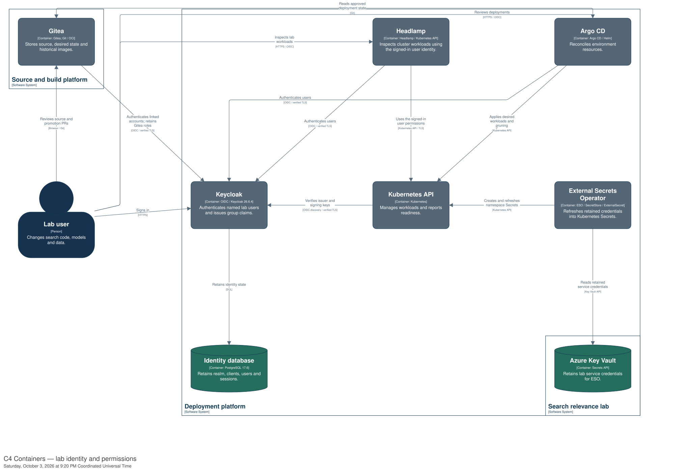

# Sign in to the lab with OIDC

Keycloak provides a local OpenID Connect (OIDC) identity provider. Use your named
account to sign in to Headlamp, Argo CD and Gitea. Each application checks its own
permissions; signing in does not grant administrator access by itself.



## First sign-in

Complete [workstation DNS and certificate trust](workstation-access.md) once.
The identity service uses the same lab root certificate.

1. On the machine hosting the lab, retrieve your initial credentials. On this
   Windows host, run PowerShell from any directory:

   ```powershell
   $account = (Get-Content -Raw -LiteralPath 'D:\codex\Ephemeral Elasticsearch\.lab\oidc\users.json' | ConvertFrom-Json).finnnk
   $account | Select-Object username, password
   ```

   Expect your username and temporary password. Keep the output private. This
   reads the retained lab state; it does not require a repository checkout or
   the lab's Python dependencies. If you are on another machine, ask the lab
   operator for your initial credentials.

   On a Linux or macOS lab host, set the retained state path and use Python 3's
   standard library. These commands also work from any directory:

   ```sh
   export LAB_STATE_DIR=/path/to/retained/.lab
   python3 -c 'import json, os; from pathlib import Path; a = json.loads((Path(os.environ["LAB_STATE_DIR"]) / "oidc/users.json").read_text())["finnnk"]; print("Username:", a["username"]); print("Temporary password:", a["password"])'
   ```

2. Open [Headlamp](https://headlamp.localhost:34443/), choose OIDC sign-in, and
   enter the account name and temporary password. Set a new password when asked.
3. Open [Argo CD](https://argocd.localhost:34443/) and choose **Log in via Lab
   identity**. An existing Keycloak session can sign you in without another
   password prompt.

Gitea links your OIDC identity to your existing Gitea account. Repository
permissions and its administrator role remain managed in Gitea.

| Account/group | Kubernetes through Headlamp | Argo CD |
| --- | --- | --- |
| `finnnk` / `lab-admins` | Cluster administrator | Administrator |
| `lab-reader` / `lab-readers` | View workloads; cannot read Secrets or mutate resources | Read-only; cannot sync |
| No lab group | No workload access | No application access |

The same file holds the reader's initial credentials under `lab-reader`.
In PowerShell, use `.'lab-reader'` instead of `.finnnk` in the command above. Password updates are stored in Keycloak, not written back to the
initial-password file. Reinstallation leaves existing passwords unchanged.

## Install and verify

Requires the running local lab, Headlamp, ESO/Key Vault delivery, HTTPS ingress,
automatic lab DNS, Helm, kubectl, Docker and Python dependencies from
`lab/requirements-https.txt`. Run the commands below from the
**ephemeral-elastic-search-stack repository root**, not `delivery-source`,
with `LAB_STATE_DIR` set:

```powershell
$env:LAB_STATE_DIR = 'D:\codex\Ephemeral Elasticsearch\.lab'
python lab/install_oidc.py install
python lab/verify_oidc.py
```

The installer prints the service URLs and whether it restarted the Kubernetes
server. Adding authentication requires one server-only restart; repeating the
same configuration does not. It preserves the server volumes and workers,
including the optional GPU worker. Run it again after recreating a lab node;
node-local API-server configuration is not part of an experiment's frozen state.

The verifier uses disposable accounts and real login callbacks. Expect a JSON
report covering admin, reader, unassigned-user and wrong-audience checks. It
removes the probe accounts, probe client and temporary kubeconfig afterwards.
It does not change your password or run an application sync.

| Component | Configuration |
| --- | --- |
| Identity service | Keycloak 26.6.4 and PostgreSQL 17.6 in `lab-identity`; database on a PVC |
| Issuer | `https://identity.localhost:34443/realms/relevance-lab` |
| Client credentials | Azure Key Vault, locally emulated by Floci; ESO supplies Kubernetes Secrets |
| Bootstrap credentials | Ignored operator state and a bootstrap Secret |
| Kubernetes identity | Immutable subject, prefixed `lab-oidc:`; prefixed group claims |
| Headlamp | Native OIDC with PKCE; uses the user's token, not a shared privileged token |
| Argo CD | Native OIDC; group claims map to application roles |
| Control UI | OAuth2 Proxy browser login; API verifies signed identities and enforces reader permissions |
| Gitea | Native OIDC; explicit existing-account linking; existing Gitea roles retained |
| TLS | Existing root CA; verified discovery, token exchange and API access |

The pinned image manifests include amd64 and arm64. Installation on Apple
silicon remains untested. This provider is local to the lab; an organisation's
provider can later supply the same OIDC contracts with its own issuer, clients
and group mapping.

## Link your Gitea account

1. Open [Gitea sign-in](https://gitea.localhost:34443/user/login). If already
   signed in, sign out first. Choose **lab-identity**.
2. Sign in with your Keycloak username and password.
3. On the account-linking page, enter your existing **Gitea** username and
   password. This proves ownership of that account; it may use a different
   password from Keycloak.
4. On subsequent visits, choose **lab-identity** to use the linked account.

Account linking does not create a second account or change its permissions.
Automatic registration and automatic email matching are disabled. Existing
password sign-in remains available for recovery, Git clients and machine accounts.

An operator can reconcile this integration from the lab repository, with
`LAB_STATE_DIR` set to the retained state directory:

```powershell
python lab/install_gitea_oidc.py
```

On Linux or macOS, use `python3`. Requires the existing identity service, ESO,
Key Vault delivery, lab CA, Helm and kubectl. Expect the Gitea sign-in URL.
The [verification record](research/evidence/gitea-oidc.md) describes the tests.

## Open the control UI

Open [Control UI](https://control.localhost:34443/). If you already have a
Keycloak session, it can sign you in without another password prompt.

- **Administrators** create environments and run comparisons.
- **Readers** inspect environments, searches and reports. Mutating controls
  are unavailable and the API rejects write requests.
- **Sign out** clears this application's session; Keycloak may still have an
  SSO session. Sign out of Keycloak separately to end it across applications.

Operators update the integration from the lab repository using a published
control image. With `LAB_STATE_DIR` set to retained state:

```powershell
$controlImage = (Get-Content (Join-Path $env:LAB_STATE_DIR control-image.json) -Raw | ConvertFrom-Json).image
python lab/install_control_oidc.py --image $controlImage
python lab/verify_control_oidc.py
```

On Linux or macOS, use `python3`; obtain the image reference from the same JSON
file. The installer requires the existing control Deployment, Keycloak, ESO,
Key Vault and trusted lab CA. It preserves the control PVC and waits for idle
operations before replacing the Pod. The verifier uses disposable accounts,
checks administrator and reader callbacks, denies reader writes and removes
the accounts afterwards.

## Recovery

| Problem | Action |
| --- | --- |
| Name or certificate error | Run the checks in the workstation access guide. Do not disable TLS verification. |
| Login succeeds but access is forbidden | Check the user's realm group in Keycloak; sign in again after changing membership. |
| Headlamp login succeeds but Kubernetes rejects it after a restart | Run the node-resolution repair below, then use Headlamp’s **Sign In** button. |
| Login remains on “Redirecting to main page…” | Close the callback tab and start again from Headlamp’s **Sign In** button. Keep the original window open; the login popup signals completion to it. Try a private window if old browser state persists. |
| Identity service unavailable | Check `keycloak` and `keycloak-database` in `lab-identity`. Preserve the database PVC. |
| Need cluster access while repairing sign-in | Use the retained operator kubeconfig, or [Headlamp token recovery](headlamp.md#recovery-token). |
| Need identity administration | Run `python lab/install_oidc.py credentials --user bootstrap-admin`, then open [Keycloak administration](https://identity.localhost:34443/admin/). Keep this recovery account separate from everyday access. |
| Need Gitea recovery | Use its existing local password sign-in; OAuth client linking does not replace it. |
| Need Argo CD recovery | Use its retained local administrator account; automation credentials are unchanged. |

### Repair API-server identity resolution

The lab installer adds a k3d startup hook that restores `identity.localhost`
in the control-plane node before Kubernetes starts. Docker regenerates that
node's hosts file on restart. The hook preserves Docker's entries and adds
one lab identity entry; workstation hosts files are unaffected.

For an existing cluster, run from the **lab repository**, not `delivery-source`:

```powershell
Set-Location 'D:\codex\Ephemeral Elasticsearch'
$env:LAB_STATE_DIR = 'D:\codex\Ephemeral Elasticsearch\.lab'
python lab/install_oidc.py repair-server-resolution
```

On Linux or macOS, change to your lab checkout, set `LAB_STATE_DIR` to its retained
state and use `python3`. Docker and the operator kubeconfig must be available.
Expect `startup_hook_installed: true` and `server_restarted: false`.
The command applies the mapping immediately without restarting the node or
resetting users, passwords or sessions.

Normal installation includes this hook. Run the installer again if you recreate
the control-plane container; run the repair if the `lab-oidc-edge` Service is
recreated with a different IP. No extra host process is required after installation.

Then open [Headlamp](https://headlamp.localhost:34443/c/relevance-lab/login) and
click **Sign In**. The original Headlamp window should open the cluster after
the login popup closes. Gitea login alone does not establish a Headlamp session.

MLflow, Nexus and SigNoz access integrations remain planned.
See the [next integration plan](plans/oidc-application-integration.md) and
[verification evidence](research/evidence/local-oidc.md).
