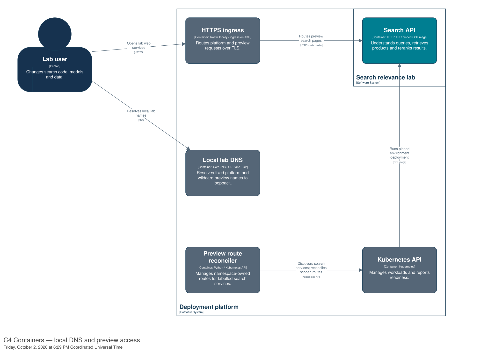

# Open search environments by URL

Each lab search environment has an HTTPS address:
`https://<namespace>.preview.relevance.test:34443/`. A ready environment card offers
**Open search page**. No port forward or per-preview DNS change is needed.



*C4 containers: CoreDNS resolves names; Traefik routes HTTPS. The reconciler manages
routes within search namespaces. [Open full-size diagram](diagrams/rendered/07-preview.svg)
or [diagram source](diagrams/workspace.dsl).*

## Set up a workstation

1. Use the lab on the machine hosting Docker. These URLs resolve to that machine's
   loopback interface; they are not LAN URLs.
2. Complete [workstation DNS and certificate trust](workstation-access.md).
3. Open **Open search page** on a ready environment. Routing reconciles every five
   seconds, so allow a few seconds after the service appears. The deployed browser
   page sends requests to that same preview's Search API.

Platform services keep their existing addresses such as
`https://gitea.localhost:34443/`. DNS and TLS listen on IPv4 loopback only.
The preview API has no login, matching the existing port-forward access model.
Opening the page or searching directly does not renew its control lease; use
**Extend lease** when needed. This is a local access facility, not a load-test path;
Gatling continues using the pinned API endpoint selected by its workflow.

## Install on the lab host

Prerequisites: installed Traefik HTTPS ingress, Docker, the retained kubeconfig
and k3d binary, and the HTTPS Python dependencies. From the lab repository root
in PowerShell, select the existing state folder:

```powershell
$env:LAB_STATE_DIR = 'D:\codex\Ephemeral Elasticsearch\.lab'
uv sync --locked
uv run --locked python lab/install_preview_urls.py
```

Expect deployment readiness, then DNS and preview HTTPS addresses. The installer
adds loopback UDP/TCP port 53 mappings through k3d's load balancer; existing
ingress mappings remain. A brief load-balancer restart may interrupt connections.
Rerun to reconcile configuration. The CA remains unchanged if still valid; the
leaf certificate gains the wildcard name. DNS uses pinned CoreDNS; its non-root
container retains only the capability required to execute the upstream binary.

The router lists namespaces cluster-wide but receives service and routing access
through RoleBindings in search namespaces only. It creates one Ingress and one
NetworkPolicy for `search:8080` in namespaces labelled `lab=search-spike`. The
policy admits Traefik to Search API Pods. It does not change frozen release
charts, images or fingerprints, or adopt another controller's resources.
New environments grant this scoped access during provisioning. Namespace deletion
removes its route; service removal is reconciled separately. Wildcard DNS still
resolves a removed preview, but HTTPS returns no preview route.

## Check and recover

In PowerShell, query the lab DNS directly before checking workstation resolution:

```powershell
Resolve-DnsName gitea.localhost -Server 127.0.0.1 -DnsOnly -Type A
Resolve-DnsName lab-dns-check.preview.relevance.test -Server 127.0.0.1 -DnsOnly -Type A -TcpOnly
.\lab\workstation-dns.ps1 Check
```

Both DNS queries should return `127.0.0.1`. The script then checks Windows'
native resolver, used by clients such as Git Credential Manager.

| Symptom | Check |
| --- | --- |
| Direct DNS query fails | Docker, `lab-dns` readiness and UDP/TCP port 53 availability. Another DNS server must not occupy the same loopback bindings. |
| Direct DNS works but native resolution fails | Install the workstation rules and check effective VPN or organisational DNS policies. |
| TLS warning | Trust the existing public CA; check that the URL contains one namespace label before `.preview.relevance.test`. |
| Preview returns 404 | Check its service, label and Ingress. DNS existence does not mean an environment exists. |
| Preview returns 503 | Check Search API readiness and the route's NetworkPolicy. |
| Router is not ready | Read `kubectl --kubeconfig "$env:LAB_STATE_DIR/kubeconfig.yaml" -n lab-ingress logs deployment/lab-preview-routes`; check namespace RoleBindings and foreign-resource conflicts. |

To pause preview infrastructure, scale `lab-dns` and `lab-preview-routes` to zero
in `lab-ingress`. Remove workstation resolver settings first if you need the
normal resolver to handle platform `.localhost` names again. Pausing reconciliation
leaves existing preview routes intact; namespace deletion still removes them.
Reinstall to resume. Port forwards remain available for diagnosis.
