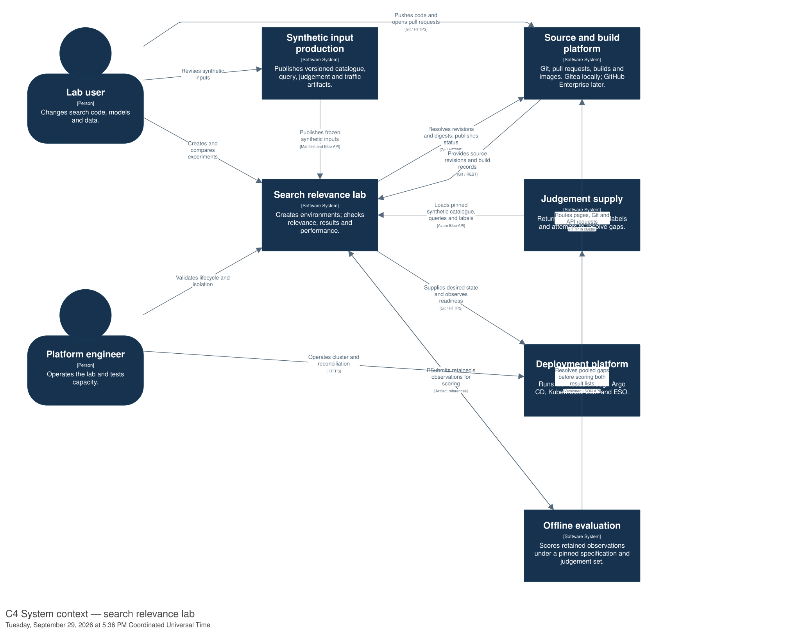
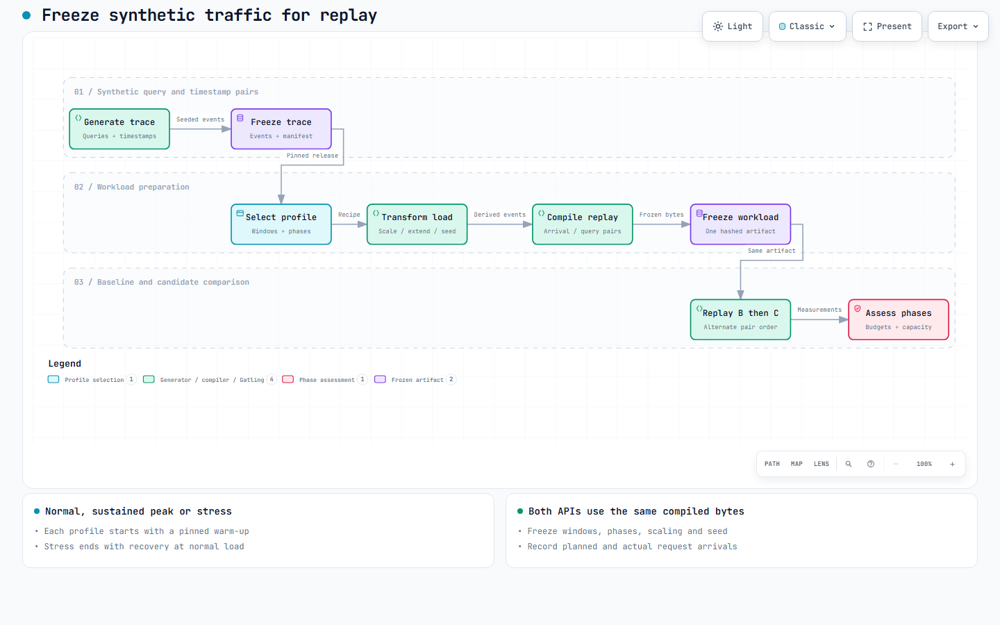
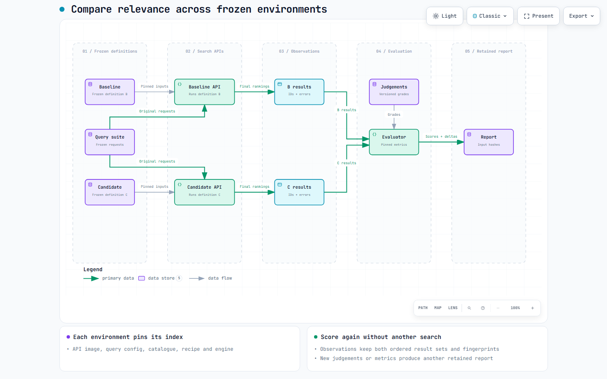
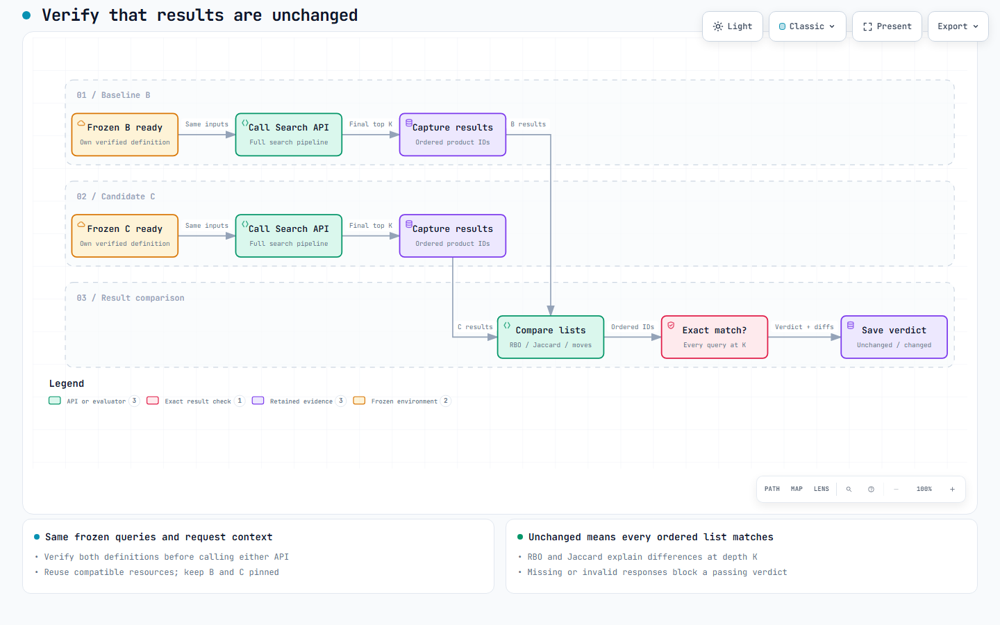
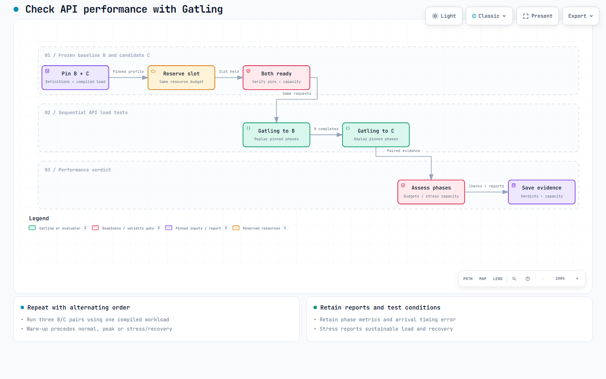

# Ephemeral search relevance lab: prototype design

## Goal and boundaries

An engineer or data scientist can create a search environment from a frozen synthetic dataset, change query/ranking behaviour or index design, compare it with a known baseline, and remove or recreate it on demand. The lab runs locally on Kubernetes and should have a clear path to self-managed Elasticsearch on Azure Kubernetes Service (AKS).

For the lab, **Lab user** covers search engineers, ML engineers and data scientists with the same workflow and capabilities. Search engineering includes relevancy and general software engineering; data science includes ML engineering and data science. These roles overlap and do not define ownership or access boundaries.

The local demonstration covers the complete source-to-disposal lifecycle. It uses a self-hosted Gitea instance for repositories, pull requests and build automation, with Nexus for new delivery artifacts; no external Git provider is required for the core workflow. The eventual target uses GitHub Enterprise. Provider-specific authentication, event payloads and status reporting must therefore sit behind a small integration boundary.

| Scope | Required scale |
| --- | --- |
| First usable slice | 10,000 UK products; 50–100 judged queries |
| Completed prototype | Measured solution shape for 1,000,000 products and 1,000 queries |
| Local demonstration | Two or three concurrent environments |
| Control-plane validation | Evidence for at least 40 concurrent environments |

Forty environments are a design and scale-validation requirement, not a promise that one laptop can host forty full copies of Elasticsearch or the catalogue.

Experiments may change the search API, its query-understanding pipeline, Elasticsearch queries and ranking, mappings or the engine version.

The core checks are **relevance**, **result preservation** and **performance**. Each compares two frozen environment definitions through their public search APIs and retains a separate verdict.

Provisional first-slice targets on a warm local cluster:

- Create an API, query-understanding or ranking-only environment against an existing frozen index in **p50 ≤ 60 seconds and p95 ≤ 120 seconds**.
- Create an index-changing environment, including reindexing all 10,000 products, in **p95 ≤ 5 minutes**.
- Go from an accepted Gitea pull-request update through tests, image build and deployment to the first correct candidate search in **p95 ≤ 8 minutes**.
- Remove an environment on demand, including its dedicated index where applicable, in **p95 ≤ 5 minutes**.
- Publish a cached CI release in **under 5 minutes**, and verify an approved promotion or rollback in **under 2 minutes** with retained artifacts and a warm compatible index. Promotion performs **zero rebuilds**.
- Preserve identical ordered top-10 product IDs for every frozen query after a behaviour-preserving change.
- Sustain **10 search requests/second** for five measured minutes per side with **p95 ≤ 250 ms**, **p99 ≤ 500 ms** and **< 1% failed requests**, under the constant-rate Gatling smoke profile below. Trace-derived normal, peak and stress profiles have separate durations and budgets.

These remain provisional acceptance targets. The [platform research](research/platform-spike.md) measured warm creation at p50 7.54 seconds / p95 8.16 seconds over 20 diagnostic trials. The [roadmap](plans/roadmap.md) links later million-product, lifecycle, 40-environment and delivery measurements; a single successful run does not establish p95. The detailed target table defines their conditions.

This is a relevance lab, not a production commerce platform. All products, queries, judgements and behavioural events are synthetic. Their modelling assumptions must travel with each dataset release.

## Proposed architecture

The architecture is maintained as a [Structurizr C4 model](diagrams/workspace.dsl), with complementary Archify workflow, lifecycle and evaluation data-flow views. Open the [diagram gallery](diagrams/index.html) for all nineteen views, or use the [diagram guide](diagrams/README.md) for their scope, editable sources and rendering commands.



| Architecture view | Contents |
| --- | --- |
| [Environment control and delivery](diagrams/rendered/02-control.svg) | Environment state and deployment containers |
| [Frozen data and end-to-end evaluation](diagrams/rendered/03-evaluation.svg) | Data, search and evaluation containers |
| [Candidate creation](diagrams/rendered/04-create.svg) | Ordered interactions |
| [Local deployment](diagrams/rendered/05-local.svg) | Persistent and ephemeral workloads |
| [Azure migration](diagrams/rendered/06-azure.svg) | Proposed deployment on Azure |
| [Immutable release delivery](diagrams/rendered/18-delivery.svg) | Nexus, promotion coordinator, Argo CD and verification |

The local lab now runs Gitea, Argo CD, ECK, the control UI/API and the lease controller. The Azure deployment remains proposed. The [platform research](research/platform-spike.md) records the original component selection and local bootstrap evidence.

| Need | Existing component | Lab-specific code |
| --- | --- | --- |
| Local Kubernetes | k3d provisionally; kind also passed Windows isolation checks; native Apple silicon verification pending | Bootstrap script and configuration |
| Elasticsearch management | Elastic Cloud on Kubernetes (ECK), installed once | Shared cluster specification and exception path for version experiments |
| Packaging and environment resources | Argo CD Git-file ApplicationSets, Helm and ordinary Kubernetes resources | A small lab API to record experiments and leases and publish desired state with conflict retries |
| Azure-compatible object storage | Floci AZ Blob Storage locally; Azure Blob Storage in AKS | Storage endpoint adapter and immutable artifact conventions |
| Relevance metrics | An established information-retrieval metrics library applied to search API responses; Elasticsearch `_rank_eval` only for retrieval-stage diagnosis | Comparison orchestration, stage evidence, report format and UI |
| Result preservation | Established ranking-similarity library plus ordered-ID equality | Exact verdict, per-query differences and pinned RBO/Jaccard settings |
| API performance | Gatling open-source Java SDK, feeders, open injection, assertions and local HTML reports | Synthetic traffic/profile preparation, slot scheduling and baseline/candidate report comparison |
| Metadata | SQLite for the local lab; a replaceable store interface | Environment records, leases and report references |
| Self-contained source and build loop | Gitea, Actions runner and Nexus | Portable workflow, immutable release descriptor and provider adapter |
| Connected observability (planned) | OpenTelemetry SDKs/Collector and self-hosted SigNoz; New Relic in the eventual target | Correlation attributes, activity/SLO dashboard, error-budget policies and backend query/link mappings |

Argo CD is already used in the target production system and is a design constraint for the prototype.

- **Deployment:** Use Argo CD to reconcile environment workloads.
- **Desired state:** The [proposed decision](adr/ADR-0001-reconcile-environments-from-git.md) uses Git-file ApplicationSets and a dedicated Gitea repository. The lab API publishes active entries, triggers refresh and retains immutable definitions after deletion. Serialize Git writes with bounded conflict retries; polling recovers missed refreshes.
- **Lab metadata:** The lab API remains responsible for dataset fingerprints, leases and comparison state.
- **Finite work:** Kubernetes Jobs cover finite indexing, evaluation and Gatling load tests. Evaluation jobs score relevance, check result preservation and compare retained load reports; separate Gatling jobs generate HTTP traffic. Comparison jobs run in a lab-owned namespace with scoped access to both endpoints and the relevant artifacts.
- **Workflow complexity:** Do not introduce another operator, workflow engine, queue or service mesh without evidence. Reconsider Argo Workflows only if the observed workflow needs retries, fan-out or auditability beyond Jobs.
- **Elasticsearch operations:** Use existing Elasticsearch APIs for aliases, bulk indexing, security roles and snapshots rather than implementing equivalents.

The [reference CI/CD](delivery.md) publishes immutable Nexus releases and promotes the same digests through integration, staging and simulated production. All three targets are local namespaces. Protected desired-state PRs require current evaluation evidence and review; Argo CD deploys the approved state, then the coordinator verifies the serving API. Rollback selects the prior image, configuration and index recipe together. [Measured promotion and rollback](research/evidence/promotion-deployment.md) passed with the million-product release and full 1,000-query checks. The [Archify workflow](diagrams/interactive/release-promotion.html) shows both frozen environments and the delivery gates.

[Nexus](nexus.md) stores private images, deployment bundles and release descriptors. Floci retains datasets, recipes and evaluation reports; SeaweedFS retains index snapshots. Historical Gitea registry images remain available. The [detailed batches](plans/reference-ci-cd.md) and [operating guide](delivery.md) record the common Actions subset and provider-specific migration boundary.

**Approved next placement, not yet implemented:** [batch 7i](plans/kubernetes-control-services.md) moves the UI/API, lease worker, PR watcher and delivery coordinator into `lab-control`. One active Pod and a persistent volume retain the present SQLite and writer-coordination model. Internal operations use service addresses and a runtime ServiceAccount. Bootstrap/recovery stays executable from the host; Nexus and snapshot storage retain their current independent lifetime. Cluster unavailability also makes these controls unavailable, which is accepted for the lab. The current diagrams still show the implemented host placement and will change with that batch.

**Planned observability:** [batch 7k](plans/otel-observability.md) adds SigNoz in `lab-observability` with OTel collection. One activity/SLO dashboard connects metrics, traces and logs: a breach leads to affected operations, their traces and related logs with applicable filters retained. Error budgets include slow successful responses and missed workflow deadlines. Unsampled SLI counts remain independent of trace sampling. Versioned instrumentation and SLO meanings carry to New Relic; dashboards, queries and deep links need backend-specific mappings. Resource fit and actual correlation support are implementation checks.

The [topology and contract assessment](plans/local-reference-boundaries.md) records the remaining local boundaries to demonstrate: installation from explicit durable inputs, interrupted-operation recovery, runtime authority, independent producers/evaluators, artifact retention references and connected observability. Operational SLO accounting does not add statistical relevance-metric validity requirements.

### Self-contained Git and build lifecycle

Gitea produces the tested candidate image. The [comparison workflow](diagrams/interactive/change-to-comparison.html) then resolves and verifies both baseline and candidate environments.

- **Platform services:** Install the upstream Gitea Helm chart in a persistent platform namespace, then run a Gitea Actions runner and publish reference releases to Nexus. The original `search-spike` path retains its Gitea registry images.
- **Repositories and data:** Bootstrap two repositories: application source (search API, query assets, UI, indexing code and tests) and environment desired state. The canonical dataset remains in Floci AZ, not Git or the registry.
- **Warm-start boundary:** Keep Gitea, its runner and registry available between environment requests; their bootstrap time is separate from warm environment creation.
- **Portability:** Pin Gitea, runner and chart versions and verify their images on Windows x64 and Apple silicon.

The source-to-comparison walkthrough is:

1. **Change source.**

   - Create a branch and pull request in Gitea with a search API query-understanding or ranking change.
   - Make a second change to an index mapping or analyser to demonstrate the slower path.

2. **Build an immutable image.**

   - A local runner tests the change, builds a multi-architecture capable image and pushes it to Nexus for the reference delivery path (Gitea registry in the original spike).
   - Capture the source commit SHA and pushed image digest. A digest, rather than a mutable branch name or tag, is the version an environment executes.
   - Retain each build under a unique source-SHA/run/attempt tag and verify digest availability. The spike demonstrated that replacing a SHA tag could leave the older digest unavailable.
   - Document where the runner obtains base images and build dependencies; mirror or cache them if the lab must also work offline after bootstrap.

3. **Register the candidate.**

   - The local watcher polls opted-in Gitea PRs and verifies the exact revision and successful build. The delivery CLI resolves successful merged-source releases for promotion. Signed webhooks remain a migration option.
   - The API validates repository, revision and digest, then combines them with a frozen dataset release, query assets and index design into an environment fingerprint.
   - A user can also create a candidate directly in the UI from a previously built digest, without opening a pull request.

4. **Provision the environment.**

   - The lab records the request and lease, publishes the desired environment to Argo CD, waits for the search API and any indexing job to be ready, and exposes the preview URL.
   - The search API uses the shared frozen index where compatible; an index change creates its own index from the same immutable dataset.

5. **Compare and retain evidence.**

   - Choose relevance, result preservation or performance. The comparison uses the same frozen inputs for both public APIs; performance runs use the pinned Gatling workload.
   - Save each verdict and report to Floci AZ and link them to the source revision, image digest and dataset manifest.
   - Users may extend the three-day lease through genuine use or delete the environment explicitly.
   - The original leased environment workflow removes namespaced workloads and owned dedicated indices. Delivery previews remove runtime and credentials while retaining recipe-addressed release indices for comparisons and rollback. Both retain immutable datasets and reports.

6. **Close or recreate.**

   - Closing or merging a pull request marks its candidate as no longer current.
   - The first prototype keeps the environment until explicit deletion or lease expiry so a comparison remains inspectable for its promised lifetime.
   - Recreating an environment from its pinned inputs must work after removal, subject to retained image and dataset artifacts.

For migration to GitHub Enterprise:

- **Adapter responsibilities:** Use an internal `SourceProvider` boundary for repository identity, pull-request reference, revision lookup, webhook verification and status/URL publication. Implement Gitea first; add a GitHub Enterprise adapter during migration.
- **Provider independence:** Keep provider-specific event bodies and API calls out of environment IDs, frozen manifests and evaluation reports.
- **Identifiers and settings:** Treat the source SHA and OCI digest as durable cross-provider identifiers; registry URLs, credentials, webhook configuration, repository IDs and PR URLs are deployment settings or provider metadata.
- **Migration checks:** When moving to GitHub Enterprise, migrate Git repositories separately from CI workflows and registry images; validate the replacement event and status integration with the same lifecycle walkthrough rather than assuming Gitea Actions is fully portable.

The [Gitea lifecycle and migration note](research/gitea-lifecycle.md) records installation, build-runner and webhook checks. Gitea provides a [Kubernetes Helm installation](https://docs.gitea.com/installation/install-on-kubernetes/), [Actions](https://docs.gitea.com/usage/actions/), [webhooks](https://docs.gitea.com/usage/repository/webhooks) and an [OCI registry](https://docs.gitea.com/usage/packages/container/).

## Research before implementation

The [platform research report](research/platform-spike.md) records the executed probes, tool comparison and proposed decision. It recommends the Argo CD-native path and retains the provisional targets. Native Apple silicon execution, cloud capacity and full controller recovery remain explicit gates; local million-product and 40-API evidence is recorded in the roadmap. The original research scope below explains what was assessed.

| Pattern to assess | What it provides | Why it might or might not fit |
| --- | --- | --- |
| Namespace and Helm release per environment | Native Kubernetes lifecycle, RBAC, quotas and policies with little control-plane overhead | Leading option for trusted engineers, but shared nodes and Elasticsearch still need explicit isolation |
| Argo CD ApplicationSet with Git files or a plugin generator | Reconciles desired environments through the production deployment tool | Git files favour review and audit; a plugin can read active leases from the lab API. Compare creation latency, failure recovery and source-of-truth complexity |
| vCluster per environment | Separate Kubernetes API and cluster-scoped resources | Worth considering if engineers must install different operators or CRDs; adds a control plane per environment and does not isolate the shared Elasticsearch data plane |
| Cluster per environment | Strong Kubernetes and Elasticsearch version isolation | Appropriate for rare engine-version tests; likely too slow and resource-heavy as the default for query experiments |

Kubernetes describes namespaces and virtual control planes as the two principal shared-cluster tenancy patterns, and notes that namespace isolation requires RBAC, quotas and network policy. Argo CD's ApplicationSet supports both Git file discovery and an HTTP plugin generator; vCluster provides a separate API and syncs workloads to a host cluster. See [Kubernetes multi-tenancy](https://kubernetes.io/docs/concepts/security/multi-tenancy/), [Argo CD Git generator](https://argo-cd.readthedocs.io/en/stable/operator-manual/applicationset/Generators-Git/), [Argo CD plugin generator](https://argo-cd.readthedocs.io/en/stable/operator-manual/applicationset/Generators-Plugin/) and [vCluster architecture](https://www.vcluster.com/docs/vcluster/introduction/architecture/).

### Existing environment platforms to investigate

[Bunnyshell](https://documentation.bunnyshell.com/docs/quickstart-ephemeral-environments) and [Northflank](https://www.northflank.ai/docs/v1/application/release/pipeline/set-up-a-preview-environment) are useful reference products for self-service creation, preview URLs, templates and cleanup, but do not assume they are open source or suitable for a self-hosted lab. Compare the following self-hostable/open source candidates against the Argo CD baseline before building equivalent lifecycle code:

| Candidate | Evidence from its own documentation | Question for this lab |
| --- | --- | --- |
| [Lifecycle by GoodRx](https://uselifecycle.com/docs/what-is-lifecycle) | Apache-2.0, self-hosted on Kubernetes; supports API-created environments without pull requests, leases, extension and teardown | Its documented onboarding requires a GitHub App, which conflicts with the self-contained Gitea requirement. Do not select it unless a Gitea integration is demonstrated; also test Argo CD ownership and the 72-hour activity policy. |
| [Uffizzi](https://github.com/UffizziCloud/uffizzi) | Apache-2.0 self-hosted environment platform; open source edition excludes RBAC, dashboard and sleep/wake | Can it provide on-demand environments and leases while leaving Argo CD as deployment authority and sharing one Elasticsearch cluster? Give this a hands-on spike if the integration is viable. |
| [Devtron](https://github.com/devtron-labs/devtron) | Apache-2.0 Kubernetes dashboard with Helm management and visibility into Argo CD applications | Does it remove enough UI/lifecycle work without introducing a competing desired-state controller? |
| [DevSpace](https://github.com/devspace-sh/devspace) | Apache-2.0 CLI for developing and deploying inside Kubernetes | Good candidate for the engineer's edit/debug loop; does it contribute to the lab's create/expire/recreate workflow? |
| [Okteto open source CLI](https://github.com/okteto/okteto) | Open source CLI supports development containers; preview and garbage-collection features require the separately licensed self-hosted platform | Assess the CLI as a developer workflow tool. Assess the full platform only if its licence and Apple silicon limits are acceptable. |

- [Signadot](https://www.signadot.com/docs/concepts/architecture) is a useful reference for routing a request to a changed search API while reusing baseline services. Its operator runs in the cluster, but its control plane is hosted by Signadot; the free Starter plan is not a self-hosted Community Edition. Evaluate it only if the self-hosting requirement changes.
- [Coolify](https://coolify.io/docs/applications/) is a self-hosted Docker deployment platform with preview deployments, but it does not provide the Kubernetes/Argo CD environment path being prototyped. Keep it as a possible lightweight UI/API demo host, not a leading environment platform.

Use the same scorecard for each candidate:

- **Project:** self-hosting, licence and maintenance.
- **Delivery and lifecycle:** Argo CD coexistence, create/recreate/delete API and activity-based 72-hour lease.
- **Search resources:** shared Elasticsearch, frozen-index reuse and index-changing jobs.
- **Operations:** isolation, Apple silicon support, observability and 40-environment cost.

Record unsupported capabilities and integration work, not just feature claims. Prefer an existing platform when it satisfies the workflow with less ongoing code and a clear single owner for desired state.

The [Okteto versus Uffizzi desk-research note](research/okteto-uffizzi.md) separates their open source and platform editions and identifies the decisive installation tests.

The [Lifecycle, Signadot and Coolify note](research/lifecycle-signadot-coolify.md) records the stronger Lifecycle case, its integration risks and why the other two rank differently.

The research spike must cover:

- **Lifecycle:** The spike should run the full Gitea branch/PR → build → digest → environment → comparison → deletion path, create and delete two environments from one frozen index, update the candidate API image and query-understanding configuration, then build a second index with a changed analyser.
- **Isolation and recovery:** Test namespaced RBAC and network access from the wrong environment, cleanup after a forced failure, and whether the selected local cluster enforces NetworkPolicy.
- **Measurements:** Record wall-clock timings and actual memory/disk use.
- **Version changes:** Run one deliberate version-changing environment separately.
- **Platform comparison:** Test a ready-made platform against the Argo CD-native path only if its Gitea integration is credible on the same small workload.
- **Selection:** Select the least complex pattern that passes the isolation and lifecycle tests; retain a documented escape hatch for vCluster or a dedicated cluster when cluster-scoped changes are genuinely needed.

The normal environment path shares Elasticsearch:

- **Persistent services:** The lab API and UI remain running. An environment has its own namespace and search API deployment, but the normal path uses a **shared Elasticsearch cluster**.
- **Environment ownership:** Each environment pins its own API image digest and query-understanding assets, and owns uniquely prefixed indices, aliases and a narrowly scoped Elasticsearch credential.
- **Index reuse:** API-only, query and ranking experiments can reuse a read-only frozen index when its mapping is compatible; index or analyser changes build a separate index from the same canonical dataset.
- **Engine changes:** Elasticsearch version changes require a separate cluster and therefore take the slower, exceptional path.
- **Isolation limits:** A namespace alone does not isolate Elasticsearch data or performance: access controls, index naming and resource limits are part of the design, and latency comparisons must account for shared-cluster contention.

ECK's default distribution has a Basic licence, while self-managed Elasticsearch licensing is controlled at cluster level. The enterprise licensing position and permitted feature set must be checked before moving beyond the Basic prototype. The lab must not depend on paid document-level security or searchable snapshots. Index-level roles are the intended isolation mechanism. See [ECK licensing](https://www.elastic.co/docs/deploy-manage/license/manage-your-license-in-eck), [self-managed licensing](https://www.elastic.co/docs/deploy-manage/license) and [Elasticsearch index privileges](https://www.elastic.co/guide/en/elasticsearch/reference/current/security-privileges.html).

### Azure boundary

Use Floci AZ for Blob Storage:

| Object prefix | Contents |
| --- | --- |
| `datasets/` | Immutable dataset releases |
| `traffic/` | Synthetic traces |
| `workloads/` | Compiled replay artifacts |
| `runs/` | Evaluation results and logs |
| `snapshots/` | Proposed Azure destination for regular Elasticsearch snapshots; local lab uses a separate S3 store |

Floci supports Blob CRUD and standard client connections. The lab now configures the account URL, dataset container and Pod download URL; local writes and signed reads have passed. The proposed Azure client uses workload identity and user-delegation read SAS, pending an AKS tenant check. The [portability design and open gates](research/portability-azure.md) also separates GHES source from ACR images.

Add emulated Key Vault, registry, queue or AKS only when a real integration needs exercising. See [Floci AZ](https://github.com/floci-io/floci-az) and its [quick start](https://floci.io/floci-az/getting-started/quick-start/).

## Frozen dataset contract

**Independent contract slice:** [batch 7j](plans/independent-data-evaluation-contracts.md) publishes catalogues, query suites, judgements and traffic under separate manifests. Environments pin software, catalogue and index inputs; executions pin requests and workloads; evaluations pin retained observations, judgements and the evaluator specification. An independent producer Job publishes synthetic inputs, and a separate evaluator image rescores observations without another search or index build. A revised query suite produced another capture against the same environments. Reports and promotion policy have separate contracts. The control UI and existing delivery coordinator still use their legacy selectors and gates; [the contract guide](data-evaluation-contracts.md) and [evidence](research/evidence/independent-data-evaluation-contracts.md) identify that integration work. Existing combined releases and recipe hashes remain readable and unchanged.

A release is an immutable set of content-addressed objects plus a manifest. Example release ID: `uk-retail-v1`. Its manifest records:

- Generator source revision, generator version, seed and deterministic ID scheme.
- Schema version, country `GB`, locale `en-GB`, currency `GBP` and a fixed effective timestamp.
- Product and query counts; file paths, byte sizes and SHA-256 hashes.
- Product modelling assumptions and distributions, including categories, brands, prices, availability, popularity, spelling variants and synonyms.
- Query intents and frequencies, original request text and context, graded relevance judgements, judgement-generation method and known biases. Keep original input separate from any API-produced normalisation or rewrite.
- Optional synthetic click, add-to-basket and purchase events with an explicit behavioural model.

The million-product generator will use the versioned [ESCI-informed synthetic profile](research/esci-synthetic-calibration.md) as a modelling reference. It uses aggregate catalogue shape and judgement depth while generating all product and query records anew. The 10,000-product `retail-gb-10k-v1` release remains unchanged.

Product and release rules:

- **Product fields:** Product records have stable IDs and realistic fields: title, description, brand, category hierarchy, attributes, price with currency, availability, popularity and country.
- **Price and market:** Prices are integer minor units. Country and currency remain explicit fields even though the first release is UK/GBP.
- **Determinism:** Fixed time and seed prevent stock, promotions and popularity from drifting between runs.
- **Release immutability:** The generator must not regenerate a release in place: a changed input produces a new manifest and hashes.

Query and judgement rules:

- **Query coverage:** Use a mixture of common head queries, long-tail attribute queries, category browsing, misspellings, synonyms, ambiguous terms and zero-result cases.
- **Judgements:** Judgements are graded and keyed by query ID and product ID. Document how synthetic relevance was assigned; evaluations measure agreement with that model, not real customer benefit.
- **Held-out evaluation:** Keep a held-out query subset so tuning against the visible set does not silently become the only reported outcome.

The canonical release remains usable if index mappings or Elasticsearch versions change. Each new environment now pins a content-addressed index recipe in Blob storage: the full mapping and settings, release manifest and product hashes, document count, indexer source and image digest, and Elasticsearch version. A historical dedicated index can be rebuilt from that recipe after its local mapping file changes. The shared baseline keeps its release-named index; a conflicting mapping or version is rejected instead of replaced. New schema experiments use dedicated indices. Existing environment records created before recipes were introduced have no historical recipe and cannot claim this restoration guarantee.

Index recovery now follows the pinned recipe. The control plane first reuses a verified target, then clones an exact recipe-marked live copy, then tries a regular snapshot when `LAB_SNAPSHOT_REPOSITORY` names a configured repository. If no compatible copy is available, it rebuilds from the frozen products and historical indexer. The environment record reports the selected path, seconds and recoverable errors. A partial clone or restore is removed before rebuild. The search API binds to the index only after count, mapping, settings, write block and ordered sample checks. Older unmarked shared indices can still be reused through their existing compatibility check but cannot serve as clone sources.

Snapshots are named by recipe hash and retained independently of the 72-hour environment lease. The snapshot includes one index, recipe and product hashes, engine version and an ordered ID sample; it excludes global cluster state and aliases on restore. A snapshot is an accelerator, while the immutable release and recipe remain the recovery authority. The shared lab cluster now has a verified `lab-s3` repository in a separate host Docker volume. Snapshot and destination versions must also be compatible. The host-local volume is not an off-host backup, and Azure Blob compatibility remains unverified. See [Elastic snapshot compatibility](https://www.elastic.co/docs/deploy-manage/tools/snapshot-and-restore/restore-snapshot) and the [three recovery workflows](diagrams/index.html#schema-and-index-recovery).

### Frozen traffic and workload contract

| Artifact | Purpose |
| --- | --- |
| **Traffic trace** | Records synthetic query/timestamp pairs |
| **Profile recipe** | Selects and transforms the trace |
| **Compiled workload** | Binds the requests, arrival schedule and phases that Gatling will execute |

Each is versioned independently of the frozen catalogue, references its inputs by hash and survives environment deletion.



The existing dataset generator also produces traces and compiles workload recipes as separate batch commands. Its trace model covers head/long-tail frequency, repeated queries, bursts, quiet periods, daily peaks, changing category popularity, misspellings and zero-result searches. Query text and timestamps are entirely synthetic and compatible with the synthetic catalogue. A future generator may use approved aggregate traffic statistics as modelling inputs; the lab does not ingest production request records.

A trace contains stable event IDs, elapsed arrival offsets, query IDs and request context. An illustrative event is:

```json
{"event_id":"e000042","offset_ms":190,"query_id":"q0017","country":"GB","currency":"GBP"}
```

- **Request binding:** Query IDs resolve to frozen original request text and any filters or paging parameters.
- **Ordering:** Preserve duplicate queries and simultaneous events; event ID breaks equal-timestamp ties deterministically.
- **Validation:** Validate non-negative ordered offsets and all query references.
- **Counts:** Record both unique query count and event count: 1,000 unique queries may produce many more load-test requests.
- **Model limits:** Pairs alone do not establish sessions, personalisation or navigation; additional behaviour needs its own documented synthetic model.

| Artifact | Pinned inputs and output |
| --- | --- |
| Trace manifest | Generator revision, schema, seed, duration, event count, catalogue/query hashes and distribution assumptions |
| Profile recipe | Source windows, phase boundaries, warm-up policy, scaling method, duration, bucket width, connection policy, timeouts, budgets and stop conditions |
| Compilation | Compiler version and seed; immutable request data, per-phase arrivals and a manifest with hashes written to `workloads/` |

Both B and C receive exactly the same compiled artifact; neither samples or regenerates traffic during the run.

- **Clock:** Use offsets from a monotonic run/phase start to schedule requests. The fixed business clock used for catalogue state remains a separate input.
- **Initial scheduling:** A timestamp in a Gatling feeder supplies data; it does not schedule traffic. Initially compile one-second buckets into Gatling open injection steps and phase-specific feeder data, preserving bucket counts and query mix with a deterministic within-bucket order and placement.
- **Event binding:** Bind each planned arrival to an event ID and request before dispatch; concurrent feeder consumption must not silently move queries between phases or buckets. Validate this binding in the implementation spike.
- **Gatling interfaces:** Gatling provides [feeders](https://docs.gatling.io/concepts/session/feeders/) and [open injection profiles](https://docs.gatling.io/concepts/injection/); preparation supplies their shared schedule.

Replay accuracy and limits:

- **Approximation:** Bucket replay approximates the source trace and can smooth sub-second bursts.
- **Timing evidence:** Record source-to-compiled timing changes separately from compiled-to-actual scheduling error. Compare source, compiled and observed arrival counts, query frequencies and repeat intervals.
- **Finer timing:** Reduce the bucket width when a profile depends on shorter bursts. Event-timed replay is a later option, gated by a scheduling-accuracy and generator-overhead spike; it is not a capability claimed by the initial design.
- **Late arrivals:** Late arrivals remain visible, and a pinned lateness rule marks an unreliable run inconclusive rather than silently dropping requests or dispatching a catch-up burst.

## Environment lifecycle and API

Each baseline or candidate runtime follows the [environment lifecycle](diagrams/interactive/environment-lifecycle.html): provisioning, frozen-index reuse, representative failure/retry and disposal. Its scope notes are in the [diagram guide](diagrams/README.md#interpretation-and-scope).

- **Request inputs:** An environment request names a dataset release, search API image digest, query-understanding asset and configuration revisions, ranking configuration, index design revision and, normally, the shared Elasticsearch version.
- **Frozen definition:** The immutable environment definition pins these inputs; its fingerprint identifies an exact build. Store that definition with the retained artifacts.
- **Runtime instance:** A running namespace is an instance of the definition, with its own state and lease.
- **Safe reuse:** Creating the same fingerprint twice should be safe and reuse existing immutable index artifacts where possible.
- **Metadata:** A namespace label and metadata record carry the owner, fingerprint and expiry.

States: `requested` → `provisioning` → `indexing` → `ready`; any active state may become `failed` or `deleting`.

- **Deletion:** `deleted` is terminal for that runtime instance. Its frozen definition, referenced images and query assets, canonical dataset and saved reports persist.
- **Recreation:** A new request can name a retained recipe SHA-256 from a previous environment. The lab verifies that it was previously pinned, loads the complete recipe from Blob storage and rebuilds a missing index from the pinned dataset and indexer. A shared index with a conflicting schema fails closed; dedicated indices can coexist under separate names.
- **State evidence:** The API exposes errors and timings for every state transition.

Initial endpoints:

| Endpoint | Purpose |
| --- | --- |
| `GET /datasets` | List immutable releases and their manifests |
| `POST /environments` | Create or reuse an environment from a release and revisions |
| `GET /environments` and `GET /environments/{id}` | List state, URL, timings and expiry |
| `DELETE /environments/{id}` | Remove an environment on demand |
| `POST /environments/{id}/activity` | Record genuine use and extend expiry |
| `GET /environments/{id}/search` | Proxy the small search API for the UI |
| `POST /comparisons` and `GET /comparisons/{id}` | Run and inspect a baseline/candidate comparison; pin mode (`relevance`, `result-regression` or `performance`); performance also pins recipe and compiled-workload hashes |

- **Lease:** Expiry starts 72 hours after creation. Genuine activity extends it to 72 hours after the last use; passive health checks and background polling do not.
- **Cleanup:** A Kubernetes CronJob scans leases, marks expired environments for deletion, removes their namespaced resources and credentials, and reconciles partial failures. Manual deletion uses the same idempotent cleanup path.
- **Job TTL:** Deleting a completed Kubernetes Job with `ttlSecondsAfterFinished` is separate from the environment lease; that native TTL does not expire namespaces or long-running Deployments. See [Kubernetes Job TTL](https://kubernetes.io/docs/concepts/workloads/controllers/job/).

Shared immutable indices may outlive one environment while another uses them. Reference counts must be derived from live environment records before deleting an index. The first implementation may retain shared baseline indices until an explicit garbage-collection operation, provided it reports their storage use.

## Search and comparison

| Mode | Decision | Evidence |
| --- | --- | --- |
| [Relevance](diagrams/interactive/evaluation-dataflow.html) | Does the candidate improve judged search relevance? | Final API rankings scored against frozen judgements; per-query gains and losses |
| [Result preservation](diagrams/interactive/result-regression.html) | Did ordering or membership change? | Exact ordered-ID equality; RBO, Jaccard and rank moves |
| [Performance](diagrams/interactive/performance-check.html) | Does the candidate meet the load profile and performance budgets? | Gatling latency, throughput, failed requests and repeatable B/C deltas |



A comparison references **two frozen environment definitions**, baseline B and candidate C. Each pins its API image, query assets and configuration, index definition/artifact, canonical dataset and engine version. Resolve or recreate both runtimes, verify each against its own fingerprint and confirm both APIs are ready before sending evaluation requests. The fingerprints identify each side independently; they do not have to match one another.

The local control UI offers a **quick** 50-query result preflight and a **full** frozen suite. An in-cluster evaluation Job sends each request through both public APIs, records the ordered responses and cleans up after a bounded run. The query inspector shows changed queries, largest relevance losses, ordered results and selected diagnostic records. The complete content-addressed report remains downloadable. A labelled Gitea PR can trigger this sequence against an exact successful build; the [PR-to-verdict workflow](diagrams/interactive/pr-to-verdict.html) shows the local polling, two environments, checks and report links. The PR status reports tooling completion, while relevance interpretation remains a review decision.

Both APIs receive the same frozen original queries and request context. Relevance comparisons score their final results against the same frozen judgements; result-regression comparisons check whether those results changed; performance comparisons replay the same workload separately against each API. The comparison record retains both definition fingerprints, runtime IDs, evaluation-input hashes, responses and diagnostics. Creating a comparison must not silently substitute the latest baseline or candidate.

Two definitions can share compatible immutable resources. In the [API-only example](diagrams/interactive/shared-index-reuse.html), separate baseline and candidate API deployments read one frozen index. A mapping change builds a different index from the same dataset. The [relevance comparison](diagrams/interactive/evaluation-dataflow.html) separates the two result paths; the [C4 evaluation view](diagrams/rendered/03-evaluation.svg) records their service dependencies and diagnostic interfaces.

- **Baseline:** Start with a search API that performs simple query normalisation and a BM25 baseline using a documented mapping, analysers and query template.
- **Query understanding:** Candidate API versions may change spelling correction, tokenisation, intent or entity detection, synonym expansion, query rewriting and context handling before Elasticsearch receives a request.
- **Retrieval and ranking:** Candidates may also change field boosts, filters, rescoring and business signals. A later candidate may change mappings or add a reranking stage.
- **Versioned assets:** Pin dictionaries and models as versioned assets; avoid hidden calls to external services during a reproducible comparison.
- **API contract:** The search API returns product IDs, result fields, rank, score, API/configuration fingerprint and elapsed time; it must accept country and currency explicitly even though UK/GBP is the first supported pair.

Relevance evaluation follows these rules:

- **Inputs:** A relevance comparison pins one dataset and query/judgement release and sends the same original request and context through the baseline and candidate **public search APIs**.
- **Judgement limits:** The report identifies the frozen synthetic judgement source, hashes, coverage of each returned top ten and unjudged IDs. The million-product pool includes earlier candidate results, so its score is a proxy that may favour those results. Coverage below 80% on either side marks the relevance claim insufficient; this does not generate new judgements or alter the result-change verdict.
- **Captured response:** The evaluation client records the response actually returned to the caller, including ordered product IDs, zero results, errors and client-observed duration.
- **Scoring:** Judgements are joined to those final product IDs; an established metrics library calculates end-to-end nDCG@10, MRR, precision/recall at selected cut-offs and per-query regressions.
- **Coverage:** Report zero-result and failure rates separately so failures cannot disappear from metric denominators. Include category, intent and head/long-tail slices.
- **Decision metric:** This black-box result is the authoritative comparison of relevance variants, including variants whose query understanding or reranking changes entirely outside Elasticsearch. A score from one candidate need not be comparable with a score from another; compare ordering and judged outcomes.

Use three clearly labelled evidence layers:

| Layer | Observation point | Purpose and examples |
| --- | --- | --- |
| **Black box — decision metric** | Original request → public search API → final customer-visible response | Final ranked product IDs against frozen judgements; nDCG@10, MRR, recall/precision, zero-result and error rates, client-observed latency. This layer determines relevance under the synthetic judgement model, or result preservation using exact ordered-ID equality, RBO and Jaccard. |
| **Grey box — stage diagnosis** | Correlated, versioned API trace or structured diagnostic record for the same request | Query normalisation, detected intent/entities, rewrite and synonym choices, filters, Elasticsearch request or template fingerprint, pre/post-retrieval candidate IDs, reranker input/output, stage durations and fallbacks. Stage-level recall or loss can explain where a regression appeared; a trace is never substituted for the final API response. |
| **White box — component diagnosis** | Direct, pinned Elasticsearch request against a known index and mapping | `_rank_eval`, `_profile`, `_explain` and analyser inspection where useful. These answer questions about retrieval and ranking *inside Elasticsearch*; they do not measure API query understanding, result merging, application filters or reranking. Run costly diagnostics separately or on a selected query sample so they do not distort black-box latency. |

- **Correlation:** For relevance and result preservation, every black-box request receives a correlation ID.
- **Retained evidence:** Save its original input, final response and optional diagnostic record together with the dataset/query hashes, judgement hash when used, fixed clock and context, API image digest, query assets, configuration, index/mapping fingerprint and engine version.
- **Diagnostic capture:** Diagnostic capture should be versioned and opt-in or sampled, with a check that enabling it does not alter the returned ordering.
- **Missing stages:** If a candidate cannot emit a particular stage, mark that stage unavailable rather than inventing a comparable value.
- **Original and rewritten requests:** Preserve the original request and raw Elasticsearch request separately: one API change may legitimately produce different Elasticsearch inputs for the same original query.

Comparison execution and reporting:

- **Request order:** For functional checks, interleave baseline and candidate requests or randomise their order. Performance uses the sequential paired-run protocol below.
- **Shared resources:** Record cache state and shared-cluster contention, and keep each mode's verdict separate. A contended shared cluster is useful for correctness comparisons but cannot by itself establish a performance improvement.
- **Report navigation:** For relevance comparisons, the report UI should lead with the black-box scorecard, then allow per-query inspection of grey-box traces and optional white-box Elasticsearch diagnostics.
- **API-only changes:** An API-only regression must be visible even when `_rank_eval` on an unchanged Elasticsearch query and index reports no difference. Elasticsearch's [ranking evaluation API](https://www.elastic.co/docs/reference/elasticsearch/rest-apis/search-rank-eval) remains a useful component diagnostic, never the source of the end-to-end score.

### Result regression: preserve ranking and membership



Use the [unchanged-results workflow](diagrams/interactive/result-regression.html) when a refactor, dependency update or other change should preserve search results. It uses the same frozen B/C definitions, readiness checks, API calls and comparison runner. Select `result-regression` as the comparison mode; relevance judgements are optional and do not determine this verdict. API query understanding, filtering and reranking are included because the runner compares final public API responses.

1. Pin both definitions, the query suite, request context, comparison depth and evaluator version. Start with **K = 10** and the full frozen query suite; repeat at the 1,000-query scale milestone. Both sides use the same catalogue release, original inputs, UK/GBP context, fixed clock and random seeds where applicable.
2. Capture the ordered product IDs returned by each API, up to K, for every query. Preserve actual API order; do not sort or deduplicate responses to make them match. Pin a stable tie-break rule. Check repeated baseline runs for instability before interpreting candidate differences.
3. Compare each pair and retain the differences below. Summaries include changed-query count/rate and the worst affected queries; averages cannot hide an individual failure.
4. Record **unchanged** only when every query has two valid responses with identical ordered ID lists. Any list difference records **changed**. A missing, erroneous, partial or malformed response makes the run **incomplete** and blocks a pass; retain any differences already found.

| Check | Meaning and initial policy |
| --- | --- |
| Exact ordered-ID equality at K | Acceptance check: zero changed queries across the complete suite. Covers both membership and order within the captured depth. |
| Jaccard@K | Set intersection divided by set union. Detects membership changes and ignores ordering. Two successful empty lists score 1 by convention; one empty and one non-empty score 0. |
| Rank-biased overlap (RBO) | Top-weighted ranking similarity. Initially use the extrapolated variant on captured lists with **p = 0.9**; pin the library version, variant and depth. Mark comparisons involving an empty list unavailable for RBO and retain the exact verdict and Jaccard. |
| Added/removed IDs and rank moves | Per-query evidence, including changed top result and transitions to or from zero results. |

- **Jaccard:** Jaccard similarity is one minus Jaccard distance; the [SciPy definition](https://docs.scipy.org/doc/scipy/reference/generated/scipy.spatial.distance.jaccard.html) also documents the empty-set convention.
- **RBO:** RBO has distinct lower-bound and extrapolated estimates; see the [RBO implementation reference](https://github.com/dlukes/rbo) and its linked paper.
- **Implementation:** Select and pin an established implementation during the build rather than implementing the metric afresh.
- **Verdict limits:** A similarity score close to 1 does not establish exact equality. If a later experiment allows tolerances, pin those thresholds and label its verdict **within tolerance**, keeping it distinct from **unchanged**.

Response validity and scope:

- **Short responses:** Short, complete responses are valid when fewer than K products match.
- **Duplicates:** Duplicate IDs are invalid under the unique-product response contract.
- **Empty results:** Count successful empty pairs separately so their agreement cannot conceal poor query coverage.
- **Scope:** The claim covers the frozen queries and captured depth only; it does not assert equal scores, product fields, unseen result tails, judged relevance or non-functional behaviour.

Result-preservation evidence and acceptance:

- **Evidence:** Retain both fingerprints, query/context hashes, evaluator image, metric settings, gate policy, raw responses, per-query differences and verdict.
- **Report:** The report UI should lead with the result-regression verdict in this mode, with links to grey-box traces for changed queries.
- **Acceptance examples:** Demonstrate an unchanged API refactor, an order-only change (Jaccard remains 1), a membership change and an incomplete run. All four must produce the expected outcome before this workflow is accepted.

### Performance: check the search API with Gatling



Use the [Gatling workflow](diagrams/interactive/performance-check.html) for latency, throughput and failure checks.

- **Runner:** Start with the **Gatling open-source Java SDK**, one load-generator process per Kubernetes Job, committed simulations and a pinned JDK/build/runtime image.
- **Load and assertions:** Gatling supports local execution and reports; its [injection model](https://docs.gatling.io/concepts/injection/) controls arrivals, and [assertions](https://docs.gatling.io/concepts/assertions/) check response-time and failure budgets.
- **Coordination:** The initial design needs no Gatling Enterprise service or distributed load coordinator.
- **Portability:** Verify the runner image natively on amd64 and arm64 during portability testing; cross-architecture emulation is unsuitable for benchmark evidence.

Load-test preparation and artifacts:

- **Preparation:** The [traffic-preparation workflow](diagrams/interactive/traffic-workload.html) freezes a trace and compiles the selected recipe before the lab schedules load jobs through its existing desired-state path.
- **Execution and comparison:** Gatling creates traffic and per-run evidence; the evaluation job compares the completed reports. Use the upstream runner and report format, with a small versioned adapter for comparison summaries.
- **Source and artifacts:** Keep simulations, build dependencies and workload manifests in Gitea; retain logs, HTML reports and summaries in Floci, with the same contracts after migration to GitHub Enterprise and Azure Blob Storage.

Run the performance check in this order:

1. **Pin the test.**

   - Record B/C fingerprints, catalogue and query hashes, original request/context, an immutable request schedule, simulation revision, Gatling/JDK versions, runner image, thresholds and timeouts.
   - Resolve or compile the frozen workload under the traffic contract above. Both sides replay that same artifact, including head/long-tail, misspelling and zero-result cases.
   - Use one request per virtual user with an open arrival model so a slow response does not silently reduce offered load.
   - Record actual arrival timing and completion counts.

2. **Reserve comparable resources.**

   - Hold one performance slot per shared Elasticsearch cluster using the lab's metadata lease.
   - Both runtimes must be ready, with fixed equal API replica counts and resource budgets; pin shard layout, engine settings, placement and cache policy.
   - Suspend competing lab indexing and comparisons for the isolated profile.
   - Measure host, generator, API and Elasticsearch CPU, memory, GC and throttling. A namespace alone does not provide performance isolation.
   - On Azure, place the generator on separate reserved workers; laptop runs remain host-specific evidence.

3. **Warm and measure each side separately.**

   - Select a constant-rate or trace-derived profile from the table below.
   - The constant-rate smoke profile retains a 30-second ramp, 60-second warm-up and 300 seconds of steady traffic at 10 requests/second against 10,000 products, returning top 10.
   - Warm each side immediately before measuring it.
   - Use distinct request names for warm-up and measured traffic within the same process, and scope assertions to measured requests.
   - Keep a fixed connection/reuse policy and let outstanding requests finish within a pinned drain timeout.
   - Do not flush a shared cache as a shortcut to a cold test. Cold starts, sustained peak and stress/recovery use separate profiles with their own budgets and duration.

4. **Repeat paired runs.**

   - Run B then C, C then B, B then C: three runs per side, without concurrent load on B and C.
   - Use the same warm-up, request schedule and resource limits each time, and wait for resource activity to settle between runs.
   - Collect all six reports.
   - Expensive profile/explain and full trace replay are disabled during measurement; use a separate diagnostic replay for investigation.

5. **Assess validity, then budgets.**

   - Report measured p50/p95/p99, offered and achieved rates, successful throughput, timeouts and failed checks, plus paired deltas and variation between repeats.
   - Enforce normal/peak acceptance budgets with Gatling assertions and relative budgets in the report comparator.
   - For stress, retain per-step budget breaches as capacity evidence rather than treating the first expected breach as failure of the entire campaign.
   - Do not average percentiles into a claimed pooled percentile. Report each run and the median of the three paired p95 percentage changes explicitly.

#### Traffic profiles and phases

Default to separate normal, sustained-peak and stress/recovery checks, each with its own warm-up. A combined run is also possible when the recipe explicitly preserves phase order, carries cache state forward and reports each phase separately.

| Profile | Trace preparation | Measurement and outcome |
| --- | --- | --- |
| Warm-up | Select a representative window preceding the measured traffic, preserving repeated queries and timing. Pin its duration and request mix. | Establish the declared cache/runtime state; exclude its requests from acceptance latency percentiles. Record warm-up failures and abort if the declared readiness condition is not reached. |
| Normal load | Select a typical synthetic window with its varying arrival rate and query mix. | Apply pinned latency, failure and relative B/C budgets. The constant-rate 10 requests/s profile remains a separate smoke check. |
| Sustained peak | Extend a busy period with seeded blocks of synthetic traffic that preserve bursts and changing popularity. | Apply peak-specific budgets across the full hold period; report latency/failure time series and resource drift. Avoid looping a tiny hot-query sample that artificially improves cache hits. |
| Stress | Increase arrivals in declared steps while retaining the selected mix. Pin each step's hold time and target-resource stop limits. | Report the highest tested load that meets the budget, the first breaching step and its limiting resource. Reaching the intended breaking point is a capacity observation, not an automatic normal-load failure. |
| Recovery | Return to the pinned normal profile after stress. | Measure time until latency, errors and resource/backlog indicators meet recovery budgets for a declared stable interval. If a stop condition prevents recovery, report it as unmeasured. |

| Scaling method | Effect |
| --- | --- |
| **Compress time** | `new offset = original offset / factor`; also shortens query-repeat intervals |
| **Increase volume over the same duration** | Uses seeded arrival generation to add requests without shortening the chosen test duration |

Record the selected method. Neither transformation can preserve every property of the original trace. Freeze the derived output and document changes to burstiness, ordering, repetition and cache working set.

Extending peak load uses a pinned block-selection method and seed, with continuity at block boundaries checked before execution.

| Initial recipe phase | Provisional duration and load |
| --- | --- |
| Normal | Five measured minutes |
| Sustained peak | Fifteen measured minutes |
| Stress | Two-minute holds at 1×, 1.5×, 2× and 3× the selected normal rate |
| Recovery | Five minutes after stress |

These are provisional profile durations, not capacity claims. Define peak intensity, phase budgets, warm-up length, stop limits and recovery interval before a run; they remain hardware-calibration decisions. A short smoke run does not establish sustained-peak or endurance behaviour.

- **Continuous phases:** Compile continuous phases onto one arrival timeline when requests may span boundaries. Attribute responses to the phase in which their request was scheduled and retain actual start/end times.
- **Drain boundaries:** For deliberate drain boundaries, Gatling's [sequential scenarios](https://docs.gatling.io/concepts/injection/#sequential-scenarios) wait until the preceding users finish; this is not a fixed-time phase transition. Pin which transition policy applies.
- **Arrival independence:** No request waits for an earlier response before its planned arrival.
- **Saturation:** Load-generator saturation makes a run inconclusive; target saturation under valid load supplies the stress result.

#### Constant-rate smoke policy

| Initial performance policy | Provisional threshold or rule |
| --- | --- |
| Absolute budget, each measured run | p95 ≤ 250 ms, p99 ≤ 500 ms, failed requests < 1%; applies to both B and C |
| Relative budget | Median paired candidate p95 increase ≤ 10% over B; retain all three deltas |
| Workload delivery | 3,000 measured requests per side per run at 10 arrivals/second; at least 99% of scheduled requests started within the measured interval; retain late arrivals and drain outcomes |
| Repeatability | Baseline p95 spread `(max − min) / median` ≤ 10%; greater variation makes the comparison inconclusive |
| Successful response | Expected HTTP status and valid search response contract; check failures count as failed requests, even for HTTP 200 |
| Verdict | **Pass** when validity and all budgets hold; **fail** for a valid run breaching a budget; **inconclusive** for missing evidence, generator saturation, uncontrolled competing load or unstable conditions |

These thresholds are starting hypotheses for the constant-rate smoke profile.

- **Smoke duration:** Its full six-run check takes roughly 39 minutes of ramp, warm-up and measurement, plus readiness, settling, drain and reporting; the 15-minute functional-comparison target does not apply.
- **Trace-profile duration:** Trace-profile duration is calculated from its compiled phases, repetitions and drain policy.
- **Scale validation:** At 1,000,000 products and 1,000 unique queries, rerun the fixed-load profile before increasing offered load in a separate capacity sweep.
- **Query counts:** A query suite contains unique inputs; a load test repeats them according to its pinned frequency model.
- **Calibration:** Calibrate thresholds from measured hardware evidence rather than assuming production capacity from a laptop result.

Performance evidence and verdicts:

- **Retained artifacts:** Retain per-run Gatling logs and HTML/assertion reports, source trace, recipe and compiled-workload hashes, planned/actual arrival records, all fingerprints, machine/node and resource settings, cache/warm-up policy, monitoring evidence and comparison verdict.
- **Error evidence:** Preserve timeout/error samples without logging every response body on the load generator.
- **Validity and saturation:** Missing instrumentation or load-generator exhaustion blocks a performance pass; target-system saturation under a valid offered load breaches an acceptance budget or records a stress capacity limit, according to the pinned phase policy.
- **Contention experiments:** Intentional contention uses a named, reproducible background-load profile, separate from the isolated comparison.
- **Independent verdicts:** A functional failure remains visible in its own mode even if performance passes.

Run management and acceptance:

- **Lease and slot:** An active comparison renews both environment leases and holds its performance slot until all load stops.
- **Deletion and recovery:** Manual environment deletion cancels dependent jobs and releases the slot after termination; stale slot leases are reconciled after controller or job failure. Save partial evidence as inconclusive.
- **UI:** The UI selects a trace and recipe, previews phase rates/durations and expected request counts, then displays queued/running state, phase verdicts, stress capacity/recovery, per-side reports and test conditions.
- **Verdict examples:** Demonstrate a passing baseline-equivalent run, a deliberately slower candidate that fails, and an interrupted or overloaded-generator run that is inconclusive.
- **Replay acceptance:** Also verify identical compiled bytes and event bindings for B/C, warm-up exclusion, a sustained-peak hold, a stress threshold breach and recovery. Compare observed arrival patterns with the compiled schedule before accepting trace replay.

The UI has four small views:

- Dataset catalogue.
- Environment list, creation and deletion.
- Side-by-side search.
- Comparison report with mode selection, per-query inspection and Gatling report links.

The first slice should be usable without a terminal after bootstrap.

## Startup and scale validation

- **Warm platform:** Keep Kubernetes, ECK, the shared Elasticsearch cluster and Floci running between environment creations. Pre-pull or cache images.
- **Fast and indexing paths:** API, query-understanding and ranking changes should create a search API deployment that points to an already indexed frozen release; mapping changes run an indexing Job.
- **Index recovery:** The lifecycle selects exact reuse → live clone → configured regular snapshot → pinned recipe rebuild. Live clone passed a disposable 10,000-product check in 1.219 seconds. A separate local S3 repository now passes verification and analysis on the shared cluster. Three one-million-product lifecycle restores after source deletion took 17.157–17.578 seconds, including index verification; an API environment also used the snapshot path. Floci 0.13.0 failed Elasticsearch repository verification on batch deletion, so it must not be configured as a working snapshot store.
- **Measured restore research:** An isolated one-node filesystem repository restored a million-product regular snapshot in 15.734–15.922 seconds across three warm trials and 17.922 seconds after a Pod restart. Three clones of the existing million-product index became searchable in 1.188–1.297 seconds, but clones depend on the live source. The S3-backed lifecycle measurements use different conditions, so the figures are not a controlled storage comparison. Both the filesystem PVC and local S3 Docker volume are host-local; Azure Blob remains an unmeasured compatibility and timing gate. See [the selection and limits](research/index-restoration-options.md) and [S3 evidence](research/evidence/durable-snapshot-repository.md).

Measure startup and removal separately:

- **Timing stages:** Measure separately: request → namespace ready, request → searchable, index build or restore, first successful query, and deletion.
- **Conditions:** Record cold and warm runs, machine resources, CPU architecture, dataset size and Elasticsearch shard layout.
- **Scale targets:** The first 10,000-product walkthrough has a provisional warm-start target of under five minutes. Set the 1,000,000-product target from observed measurements rather than claiming the same number will hold.

Measure the full source-to-preview path as well:

- **Source-to-search timing:** Also measure source commit → passing image digest and pull-request event → first successful search as end-to-end lifecycle timings. Keep these distinct from the warm environment figures, which start only after a validated image digest exists.
- **Webhook delivery:** Run Gitea webhook delivery through a cluster-reachable URL and validate its signature.
- **Argo CD latency:** Argo CD's ordinary Git polling can add minutes; measure a webhook or explicit refresh path before claiming the warm-start targets.

### Provisional quantitative targets

These are **design hypotheses, not measured performance or service promises**.

- **Revision policy:** Change them after the research spike and each scale run, retaining the previous value and evidence in the decision record.
- **Default conditions:** A target is tested on a warm cluster with images present unless labelled cold.
- **Startup boundary:** For environment startup, measure from accepted API request to a successful end-to-end search, not merely a running Pod.
- **Startup/removal sample:** Use at least 20 repetitions for startup/removal p95 figures and record failures rather than excluding them.
- **Search latency:** Search latency uses the separate Gatling sampling protocol.
- **Indexing and comparison sample:** For larger indexing and comparison runs, repeat at least three times and publish all results.

| Outcome | Early target | Measurement and limit |
| --- | --- | --- |
| API/query/ranking-only environment, 10,000 products | p50 ≤ 60 s; p95 ≤ 120 s | Shared index already present; local machine; request to first correct search |
| Gitea PR build → first correct candidate search, 10,000 products | p95 ≤ 8 min | Warm runner and cluster; start at accepted PR update, include test, image build/push and environment start; record build and provision phases separately |
| Index-changing environment, 10,000 products | p95 ≤ 5 min | New mapping and full reindex; request to first correct search |
| API/query/ranking-only environment, 1,000,000 products | p95 ≤ 2 min | Shared million-product index already present; suitable test cluster |
| Index-changing environment, 1,000,000 products | ≤ 20 min per run | Full reindex from frozen objects on a documented test cluster; revise after first bulk-index measurement |
| Complete 1,000-query functional comparison | ≤ 15 min per run | Two ready versions queried through their public APIs; final top 10, relevance or result-preservation metrics and persisted report; exclude index build, performance load tests and optional white-box diagnostics |
| API performance, constant-rate smoke | 10 requests/s for 300 measured seconds; p95 ≤ 250 ms, p99 ≤ 500 ms, failures < 1%; median paired p95 increase ≤ 10% | 10,000 products, three controlled B/C pairs, valid generator and stable baseline; see the Gatling profile above |
| On-demand removal | p95 ≤ 5 min | Request to namespace resources and dedicated indices gone; shared frozen index deliberately retained |
| Lease expiry | Start cleanup within 10 min of expiry; finish within 15 min | 72 h after last genuine use; no extension from polling or health checks |
| Control-plane capacity | 40 simultaneous API/query-only environments, ≥ 95% ready within 5 min of their requests | Suitable multi-node test cluster; all 40 must run a real search; record p95, errors, CPU, memory and API load |
| Isolation | Zero successful cross-environment index reads or writes in the access test suite | Test Elasticsearch credentials, Kubernetes RBAC and network reachability |
| Reproducibility | Identical product/query hashes and identical ordered top-10 results on two clean builds of the same fingerprint | Pin data, configuration and engine version; latency is excluded |
| End-to-end metric coverage | API-side query-understanding change that alters final results is detected in the black-box comparison even if the Elasticsearch index is unchanged | Keep a deliberately different API candidate in the evaluation walkthrough; show final-result and stage evidence side by side |
| Result-preservation verification | Zero changed queries for a behaviour-preserving API refactor; detect deliberate order and membership changes; incomplete runs never pass | Compare final ordered top-10 IDs across the frozen suite; retain RBO, Jaccard and per-query differences; no NFR thresholds |
| Source-to-preview traceability | 100% of ready candidate environments link a source SHA, image digest, dataset hash and comparison-compatible configuration fingerprint | Check through the UI and API; reject mutable-only references |
| Local full-lifecycle demonstration | One Gitea PR changing API behaviour and one changing an index, each built, deployed, evaluated and removed without an external Git service | Record stage timings and failures; this is an acceptance gate rather than a speculative latency target |

For the 40-environment exercise, keep API/query-only workloads small and share the frozen index. Also model the disk and indexing cost of 40 distinct million-product mappings; do not infer that the API/query-only result proves that scenario is affordable. Establish a separate capacity limit for simultaneous reindex jobs from measured throughput and cluster headroom.

Scale gate for the completed prototype:

1. Generate, hash, store and reload a 1,000,000-product release with 1,000 judged queries.
2. Build both a baseline and a mapping-changing candidate index; run relevance and result-preservation checks, plus compiled normal, sustained-peak and stress/recovery Gatling profiles; record duration, disk, memory and metrics. Use separate expected outcomes for each mode; an intentional ranking change need not preserve results.
3. Prove two or three environments on the local machine, including on-demand deletion, expiry and activity extension.
4. Exercise 40+ **lightweight environment control records and Kubernetes deployments** on a suitable test cluster or capacity model, then document measured API and reconciliation behaviour. Do not present metadata-only simulation as proof that forty full search workloads fit.
5. Repeat bootstrap and core workflow on Apple silicon macOS. Use multi-architecture images and avoid architecture-specific binaries or Windows-only scripts.
6. Test cluster-level resource contention and establish when to move from shared indices to separate clusters for valid performance comparisons.

## Delivery batches and acceptance

Each batch is committed to a branch for review. After acceptance, merge it to `main`; do not leave uncommitted changes on `main`.

1. **Design — merged:** architecture, research shortlist, provisional targets, data contract, lifecycle, scale gates and evidence sources.
2. **Research spike — for review:** local Gitea/runner, real builds and searches, Git/plugin comparison, namespace and index isolation, failure cleanup, analyser/version probes and measured timings. See the [results and remaining gates](research/platform-spike.md).
3. **Runnable search slice:** local bootstrap, Gitea, Floci Blob Storage, synthetic 10,000-product release, shared Elasticsearch, baseline search API and UI. Verify a real search end to end.
4. **Experiments:** isolated environment records and credentials, candidate search API and query-understanding revisions, ranking configurations, side-by-side search, all three comparison modes (including Gatling), frozen synthetic traces and compiled normal/peak/stress profiles, their acceptance examples and three-day lifecycle.
5. **Index changes and scale:** reproducible index builds, one-million-product release, 1,000 queries, measured startup optimisation and 40-environment control-plane exercise.
6. **Portability and Azure shape:** Apple silicon verification, AKS manifests and Azure Blob configuration, Gitea-to-GitHub Enterprise integration plan, operations and cost/capacity notes.

## Decisions to verify during implementation

- Verify the provisional k3d bootstrap natively on Apple silicon. k3d and kind passed the Windows cross-node NetworkPolicy/RBAC probes on the 96 GiB / 32-logical-CPU host; the research report records actual timings and resource use.
- Extend the successful Floci Blob/hash/conditional-create checks with negative SAS and expiry tests. Keep canonical objects immutable; the tested Floci version cannot serve as an Elasticsearch snapshot repository.
- Validate which index-level security privileges and ECK configuration are available under the organisation's intended self-managed licence. A shared cluster reduces cluster count; it does not itself settle contractual licensing terms.
- Validate Gatling image portability, report parsing, event-to-arrival binding and generator headroom; calibrate bucket width, scheduling lateness, phase budgets and noise thresholds on the documented hardware.
- Choose the metadata store for the 40+ environment path after measuring SQLite contention and deployment topology. The API must keep its metadata behind a repository interface so a PostgreSQL migration is straightforward if needed.

## References

- [Floci AZ repository](https://github.com/floci-io/floci-az)
- [ECK installation](https://www.elastic.co/docs/deploy-manage/deploy/cloud-on-k8s/install)
- [ECK licence management](https://www.elastic.co/docs/deploy-manage/license/manage-your-license-in-eck)
- [Elasticsearch aliases](https://www.elastic.co/guide/en/elasticsearch/reference/current/aliases.html)
- [Elasticsearch ranking evaluation](https://www.elastic.co/docs/reference/elasticsearch/rest-apis/search-rank-eval)
- [Elasticsearch Azure snapshot repository](https://www.elastic.co/docs/deploy-manage/tools/snapshot-and-restore/azure-repository)
- [Kubernetes Jobs](https://kubernetes.io/docs/concepts/workloads/controllers/job/)
