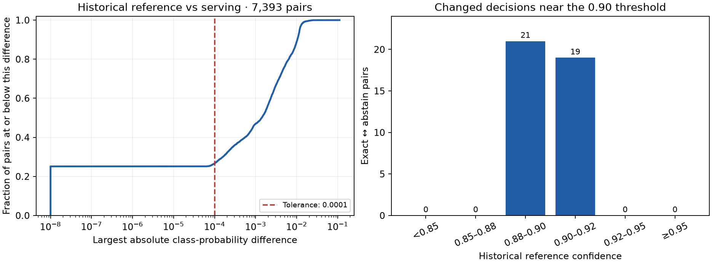

# ESCI probability diagnostics — 3 October 2026

**Result: the missing compiler caused a silent attention-kernel fallback.
Batch-size sensitivity is a separate remaining failure.** Version 2 is inactive;
the lab still uses `synthetic-esci-judge/1`. The 0.0001 tolerance, 0.90 acceptance
threshold and 80% coverage gate are unchanged.

## Larger sample

| Selection | Count |
| --- | ---: |
| Exposed historical confirmation cohort | 9,694 pairs / 600 queries |
| Excluded overlap with the current final reservation | 2,301 pairs / 143 queries |
| Eligible diagnostic cohort | **7,393 pairs / 457 queries** |
| Deterministic singleton subset | 1,024 pairs, covering all 457 queries |
| Controlled loader/kernel subset | 512 pairs / 311 queries, in 64 complete original groups of eight |

Query membership uses the research's `nfkc_html_whitespace_v1` normalisation.
There was no additional SPECIALIST-01 overlap after excluding the final
reservation. No protected assessment pair was inferred. Every input's canonical
text hash matches the saved raw-score input hash; applying the exported mapping
to those raw scores reproduces the archived mapped scores within 1e-12.

Inputs and exclusions were frozen before inference. The original collection
driver explicitly used batches of eight, and the archived score order matches
the input file order. Complete eligible groups were selected by a fixed hash
rule before the controlled probes.

## HTTP results

The original pinned serving image ran three full-cohort passes and two singleton
passes. Every returned vector was retained and aligned by pair identity.

| Comparison | Pairs | Above tolerance | Changed labels/abstentions | Maximum absolute difference |
| --- | ---: | ---: | ---: | ---: |
| Archive → serving batch | 7,393 | 5,421 (73.33%) | 40 (0.54%) | 0.110726 |
| Archive → reversed serving order | 7,393 | 5,424 (73.37%) | 40 | 0.110726 |
| Archive → serving singletons | 1,024 | 803 (78.42%) | 5 | 0.024654 |
| Serving batch → identical repeat | 7,393 | 0 | 0 | 0 |
| Serving batch → reversed order | 7,393 | 172 (2.33%) | 0 | 0.021965 |
| Serving batch → serving singletons | 1,024 | 800 (78.13%) | 2 | 0.024654 |
| Serving singletons → identical repeat | 1,024 | 0 | 0 | 0 |

For archive → serving batch, the per-pair maximum difference has a median of
**0.001405**, p95 **0.011797** and p99 **0.015057**. The 40 changed decisions span
35 queries: 21 abstain → Exact and 19 Exact → abstain. All had archived confidence
between 0.88 and 0.92. The near-unchanged accepted total, 2,740 → 2,742, hides those
changes in individual pairs. There were also 21 winning-class changes below the
acceptance threshold.

Generated from the full first HTTP pass. Zero differences are plotted at 1e-8
on the logarithmic axis. Confidence bins include their lower boundary and exclude
their upper boundary, except the final bin, which includes 1.

### Uncertainty and interpretation

Whole-query bootstrap resampling keeps each query's pairs together. The
pair-weighted estimates use 5,000 replicates and seed 20261002.

| First-pass statistic | Estimate | 95% query-bootstrap interval |
| --- | ---: | ---: |
| Fraction above tolerance | 73.33% | 72.23%–74.41% |
| Label/abstention change rate | 0.54% | 0.37%–0.72% |
| Winning-class change rate | 0.28% | 0.16%–0.42% |
| Mean per-pair maximum difference | 0.003211 | 0.003056–0.003377 |

The signed mean intervals for all four classes include zero: there is no clear
average shift towards one class on this cohort. That does not negate the measured
individual differences or threshold crossings. These effect sizes and intervals
are more useful for the decision than a test of whether a probability difference
is exactly zero.

The intervals describe this exposed cohort, not production traffic or independent
label quality. A zero-change repeat gives a bootstrap interval of [0, 0] on these
observations; it is not a guarantee of zero future failures. In the FLA control,
3/512 batch-to-singleton decision changes have a wider interval of **0%–1.34%**.
The numerical tolerance still fails regardless of that interval.

## Investigation

The same GPU, assets, question and 512 token fingerprints were used for all
controlled probes. Core package versions, BF16, CUDA 12.4, cuDNN 9.1, SDPA and
precision settings matched between the current Windows and Linux paths.

| Control | Measured result | Conclusion |
| --- | --- | --- |
| Original research loader vs serving loader in Linux | All 512 batched raw vectors exactly equal | The wrapper and adapter-loading changes do not explain the discrepancy on this set |
| Current Windows vs Linux original loader | Batched raw vectors exactly equal; mapped differences at most 2.22e-16 | The current operating-system difference is not the cause of the archived batched-score failure |
| Current raw inference vs archive, original groups | Maximum raw difference 0.027511; mapped difference 0.023493 | The discrepancy occurs before score mapping |
| Import FLA in the original serving image | Fails before inference: Triton cannot find a C compiler | An installed package is insufficient evidence that its kernel can run |
| Add gcc/libc6-dev; use the normal upstream wrapper | All 512 archived batched raw vectors exactly reproduced; mapped difference at most 1.11e-16 | The image lacked a dependency needed to select the original numerical path |
| Explicit FLA call in that same compiler image | Exactly matches normal upstream selection and archive; repeated batch exactly equal | FLA selection explains the historical batched discrepancy |
| FLA batch → singleton | Maximum raw difference 0.044415; mapped difference 0.033827; 428/512 above tolerance; three changed decisions | Compiler/FLA availability alone does not satisfy the batching contract |

Transformers' `use_kernel_func_from_hub_with_fallback` imports FLA and catches
**any import exception**, selecting its PyTorch implementation instead. The
original image's missing compiler makes Triton's driver-helper import fail. The
warning says FLA is not installed even though version 0.5.2 is present. The
historical collection log shows Triton and only the convolution fallback; the
failed runtime additionally warns about gated-delta fallback.

In the compiler-equipped image, the normal upstream wrapper already selected
FLA. The captured phase named `fallback-original` therefore means **upstream
selection**, not the PyTorch fallback; its label was chosen before inspecting
the wrapper. The original capture and its source remain intact. No diagnostic
monkeypatch is deployed to the lab.

The exact operation responsible for the remaining batch-size sensitivity was
not isolated. It is measured with both paths, so replacing the attention kernel
cannot be treated as a complete fix. PyTorch also documents that batched and
sliced computations need not agree bit for bit. [PyTorch numerical accuracy](https://docs.pytorch.org/docs/main/notes/numerical_accuracy.html)

## Conclusions and next batch

1. Require the intended attention implementation to import successfully; fail
   startup rather than silently changing numerical execution.
2. Freeze kernel selection and the inference tensor/batch protocol alongside
   weights, mapping and thresholds. Package versions alone are insufficient.
3. Test canonical singleton inference first. It gives each pair the same
   execution context irrespective of how callers group requests. Measure its
   repeatability and cost before adopting it.
4. A changed inference protocol requires a new immutable release and independently
   generated numerical references. Preserve version 2 and its historical scores;
   do not replace references with serving outputs or relax the tolerance.
5. Keep quality qualification and activation separate. These diagnostics do not
   establish the accuracy of newly supplied judgements.

The [next implementation plan](../../plans/esci-inference-contract.md) covers
explicit kernel selection, canonical inference, cold-start qualification and
telemetry. The registered candidate remains unqualified.

## Records and verification

- [HTTP aggregates](esci-probability-diagnostics.json): cohort/source identities,
  all run hashes, distributions, transitions and uncertainty estimates.
- [Investigation aggregates](esci-probability-investigation.json): raw/mapped
  comparisons, runtime settings, token-fingerprint hashes and image identities.
- Ignored `esci-packaging/parity-diagnostic-20261002`: frozen inputs/exclusions,
  every returned vector, the failed compiler attempt, logs, compiler-image
  Dockerfile, measured probe source and cleanup record.

Four diagnostic tests passed, including query correlation and threshold
crossings. Ruff and `git diff --check` passed. The scientific plot was visually
inspected. Raw query/product text and vectors are excluded from the PR.

Candidate service/Pods and diagnostic containers were removed. The active version
1 pin was verified, and the GPU was returned within the agreed window. Its owner
confirmed research resume, 512 freshly committed states and an active heartbeat;
frozen research files are unchanged. The diagnostic
compiler image is not a published or qualified serving image; the telemetry fix
has not yet received live export verification.
