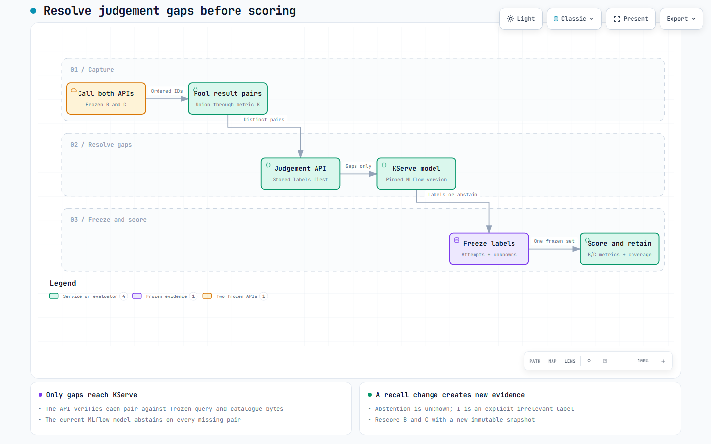

# Offline evaluation of search variants

Compare the results returned by two or more Search API configurations. Use the same saved queries and relevance labels for every configuration, then review the scores and changed results before choosing a release. A configuration is called a **variant** in the API and reports.


## Choose the variants

| Role | Meaning |
| --- | --- |
| Default | The variant used when a request has no selector; exactly one is required |
| Baseline | The variant used to calculate metric deltas; it may also be the default |
| Selected variant | A variant proposed for release and checked by the merge gate |

| Change | Evaluation | Deployment |
| --- | --- | --- |
| Replacement release, such as a dependency update | Current default versus proposed default | The proposed release replaces the current version |
| Alternative ranking settings | Two or more named variants, across one or more pinned APIs | The selected settings may later be activated through production feature flags |

Offline evaluation does not allocate online traffic. A recorded exception can accept a bounded regression for business reasons.

Exploratory comparisons may include unqualified model labels. Strict gates exclude them. The full ESCI lab has a temporary, human-authorised `demo` selection; its model predictions remain unqualified. The protected demo gate checks their exact source scope and policy. See [judgement resolution](judgement-resolution.md#temporary-esci-demo-labels).

## Prepare the comparison

For a source PR, start in the Search API repository's `gate/README.md`. Declare which variants you want to release and whether the change should preserve results or change ranking. CI must build the exact PR commit before its image is evaluated.

Agree these inputs with the lab operator:

| Input | Where it comes from |
| --- | --- |
| Variant names and default | The Search API configuration in the proposed release |
| Baseline | An agreed deployed release or a named variant in the comparison |
| API images and index definitions | CI build receipts and retained environment definitions |
| Queries, catalogue and labels | Compatible frozen manifests from the [data contracts](data-evaluation-contracts.md) |
| Model for missing labels | The pinned registry version in the [judgement workflow](judgement-resolution.md) |

The default and baseline are independent choices. The baseline supplies the comparison; it cannot also be a selected candidate in that gate decision.

For complete operator commands, use the [evaluation runbook](evaluation-runbook.md).

## Capture and score



1. **Freeze the variants.** Pin each image, index and configuration in a `search-variant-set`. Different images or schemas need separate environments; compatible variants can reuse a runtime or index.
2. **Capture results.** The [capture tool](../evaluation/capture.py) checks the deployed definitions and sends the same query suite to every API. Missing responses or identity mismatches invalidate the capture.
3. **Fill label gaps.** The [judgement workflow](judgement-resolution.md) pools query/product pairs from all variants. Stored labels take precedence; the pinned model supplies missing labels or abstains. Freeze one judgement set for all variants.
4. **Score.** The [offline evaluator](../evaluation/offline.py) reports metrics, coverage and deltas from the baseline. An abstention remains unknown.

Capture uses eight workers and adapts request spacing separately for each API
when transient failures occur. Retries are bounded and incomplete responses
remain errors. Reports retain pacing diagnostics; load tests continue to use
Gatling's declared arrival rates. See [capture execution](evaluation-runbook.md#capture-and-score).

## Read the report

| Result | What it tells you |
| --- | --- |
| nDCG@10 | How well the first ten results rank labelled relevant products |
| Judged coverage | Share of captured query/product results with labels; low coverage weakens the evidence |
| Delta from baseline | Whether a variant's measured relevance improved or declined |
| Changed-result fraction | How many queries changed returned IDs or total match count |
| RBO@10, persistence 0.9 | Result-order similarity, weighted towards the highest ranks; 1 means identical |
| Jaccard@10 | Product-set overlap, ignoring order; 1 means the same products |
| Retained API observations | The ordered IDs and totals behind each changed query |

Reports identify judgement selection and count each source. **Demo** means that model accuracy is unqualified, even when the gate passes. Read coverage beside the scores. Synthetic fixtures demonstrate the process, not real search quality. [Result-preservation comparisons](prototype-design.md#result-regression-preserve-ranking-and-membership) also provide RBO and Jaccard diagnostics.

The coordinator captures and scores source PRs automatically using pinned inputs. Each report contains every variant, baseline deltas and exact inputs. Follow its PR links or use [remote comparison commands](remote-delivery.md). If capture fails, correct the API response or deployment mismatch before scoring. If labels are missing, inspect coverage before treating scores as evidence. The operator runbook also supports explicitly prepared judgement-resolution studies.

## Supply merge evidence

Similarity scores describe change risk and do not change the gate outcome.
The summary and full variant report include their per-variant averages; the
report retains per-query scores for investigation. A future policy may require
a recorded decision for a large change in results. That rule is not enabled.

### Add queries for your change

Keep the standard frozen suite and add named JSONL query files in the source
repository. For the trainers example, select the supplied four-query file:

```json
"additional_query_sets": [
  {"name": "trainers", "path": "evaluation/queries/trainers.jsonl", "required": false}
]
```

Add this field to `gate/selection.json`. Each row needs `query_id`, `query`,
`country`, `currency` and optional `filters`. Query IDs must be unique within
that file. The coordinator reads and freezes the files from the exact PR commit.
Each suite sends fresh requests, including requests repeated in another suite.

The report contains separate suites and a combined view. Combined scores give
each query case equal weight and disclose repeated requests. Relevance scores
include only labelled suites; unlabelled suites still report result overlap,
order and unknown coverage. The combined view never decides the gate.

Extra suites report only by default. To require one, set `required` to `true`
and provide `judgements`, the path to its matching reference-label JSONL file.
Labels need `query_id`, `product_id` and an ESCI `grade` from 0 to 3. Review
authored labels as reference data; do not paste model predictions into this file.
Model predictions retain their qualification behind the judgement API.
Every required suite must pass independently. The standard ESCI demo allowance
does not apply to extra suites.

| Step | Required record |
| --- | --- |
| Declare intent in the source PR | `gate/selection.json`: one or more variant names, each with `ranking-change` or `preserve-results`; no source SHA |
| Build the exact PR commit | Release CI publishes the image and immutable Nexus build receipt |
| Evaluate that image | Retain the frozen report, then issue its signed attestation |
| Publish evidence | `variant-gates/<source SHA>/report.json`, `attestation.json` and `approvals.json` in Nexus |
| Read the coordinator status | `relevance-lab/merge-gate` checks signatures, policy, selection, source SHA and the attested image after fresh capture |

The captured image must match the attested build receipt, even if a later CI attempt builds another image. Missing or mismatched evidence fails. The reviewed coordinator pins the policy and verifier; Actions pins its protected submission client.

Behavioural changes require evidence. The [README exemption](relevance-gate.md) skips evaluation only; tests and builds still run.

## Gate outcomes and human decisions

The current policy checks nDCG@10, at least **80% judged coverage for both baseline and candidate**, delta from baseline and changed-result fraction.

| Outcome | Next action |
| --- | --- |
| `pass` | Review the evidence and selected release choice; no exception is needed |
| `decision_required` | A bounded regression or result change needs an administrator's signed exception with a substantive reason |
| `approved_exception` | Review the measured result and recorded reason separately |
| `blocked` | Fix the regression or improve coverage; an exception cannot bypass this result |
| `invalid` | Correct incomplete, stale or mismatched evidence and rerun the check |

Exceptions bind the report, policy, commit and selected variant without altering scores. A replacement becomes the default on promotion. Deployment still requires approval.

Named configurations live in `SEARCH_VARIANTS_JSON`. Requests use `X-Lab-Variant` to select one, or omit it for the default. Capture checks the echoed variant ID and configuration digest.

Optional [exploratory notebooks](data-evaluation-contracts.md#exploratory-notebooks-after-a-comparison) retain their findings separately from the gate verdict.

- [Managed gate rehearsal](research/evidence/managed-variant-gate.md): a blocked live report and a separate fixture pass.
- [Gate policy](../lab/delivery/policies/variant-merge-v1.json): thresholds and exception bounds.
- [Delivery guide](delivery.md): promotion and rollback.
