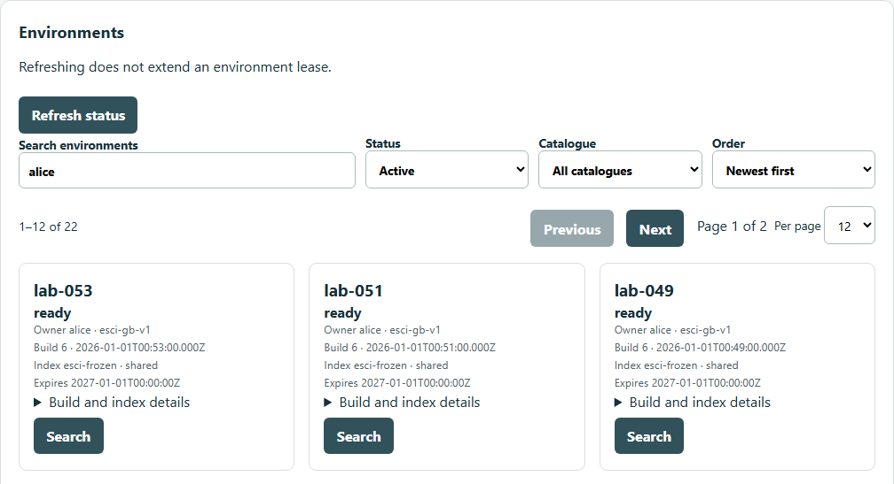
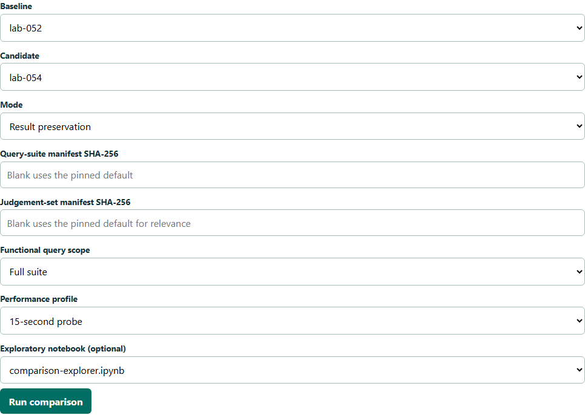
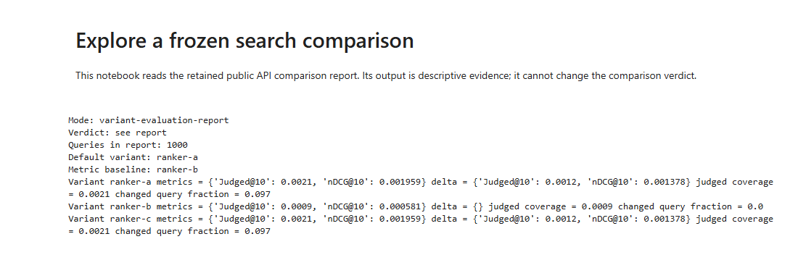

# Create and compare search environments

Use the lab control UI to deploy a pinned Search API, compare it with a baseline and remove it when finished. Each comparison keeps the environment definitions, selected inputs and report so it can be reproduced.

This guide assumes an **installed lab**. Operators should start with [control runtime](../docs/control-runtime.md); first-time platform experiments have a separate [bootstrap guide](../research/platform-spike/README.md). Search API development and the disconnected mock demo are in the [source README](delivery/bootstrap/README.md).

To inspect Pods, deployments, events and logs, use [Headlamp](../docs/headlamp.md).

## Open the control UI

Prerequisites: your own lab identity, a trusted lab certificate, working local
DNS and ready control services. See [OIDC access](../docs/oidc-access.md) for
sign-in and [control operations](../docs/control-runtime.md#connect-and-check)
for readiness checks.

1. Open [Control UI](https://control.localhost:34443/) and sign in with your lab identity.
2. Administrators manage environments and comparisons; readers inspect searches and reports.
3. Find a successful build in `elastic-agent/search-spike` → **Actions**. Copy the run ID from `/actions/runs/<id>`, not the PR number. The control UI resolves its commit and image digest.

The **Environments** list initially shows active environments, newest first.
Search by name, owner, build or index; use **Status** and **Catalogue** to narrow
it down. Choose **All** under Status to include deleted environments.

The **Comparisons** list shows baseline and candidate names. Search names or a
comparison ID, then filter by **Check**, **Status** or **Verdict**. Both lists
have **Previous**, **Next** and **Per page** controls. Refresh keeps your filters
and ready-environment selections. Filtering cards does not remove choices from
the comparison form.

Open a report to search its query text or IDs and page through results. Changing
a report filter returns to its first page; the JSON download still contains the
complete pinned report.



*Synthetic UI fixture: searching for Alice's environments. The image shows the
list controls and first row; the page contains 12 of 22 matches.*

The control workers already run in Kubernetes. Do not launch host control, lease or watcher processes beside them.

## Create an environment

1. Under **Create an environment**, enter a name beginning `lab-`, such as `lab-ranking-review`, and the **Gitea build run number**.
2. Select a **Frozen release** and **Index**. Use a shared index for API/query/ranking changes; choose a dedicated mapping for index experiments.
3. Leave **Historical index recipe SHA-256 (optional)** blank for the current definition. Supply a retained recipe only when recreating an earlier index.
4. Choose **Create**, then **Refresh status**. Wait for `ready` before searching or comparing. If it fails, read the card's error before choosing **Retry**.

| Release | Intended use |
| --- | --- |
| `esci-gb-v1` | Default: 1,215,854 English ESCI products, GBP lab prices and 1,000 test queries |
| `esci-gb-demo-v1` | Optional demo subset: 10,000 products and 50 test queries |

See [catalogue setup](../docs/esci-catalogue.md) to configure the demo size. Normal workflows reuse the full frozen catalogue.

A new environment retains its source commit, image digest, index recipe and fingerprint. The 72-hour lease extends with genuine activity; status polling does not extend it. **Search** runs a query and **Extend lease** renews it explicitly.

After [preview access](../docs/preview-access.md) is installed, choose **Open search
page** on a ready card. Its URL is
`https://<environment-name>.preview.relevance.test:34443/`; each preview opens
separately without local port selection. Workstation DNS and browser trust are
one-off setup steps.

For diagnosis or a workstation without preview DNS, use a port forward in a separate terminal:

```powershell
# PowerShell, repository root. Select the existing retained state directory.
$env:LAB_STATE_DIR = (Resolve-Path .lab).Path
$kubeconfig = Join-Path $env:LAB_STATE_DIR kubeconfig.yaml
$environmentName = Read-Host 'Ready environment name from the control card'
kubectl --kubeconfig $kubeconfig -n $environmentName port-forward svc/search 18080:8080 --address 127.0.0.1
```

After `Forwarding from 127.0.0.1:18080` appears, open [http://127.0.0.1:18080/](http://127.0.0.1:18080/). Keep the terminal running. If comparing browser pages, use a second port such as `18081` for the candidate.

## Compare a pinned API candidate

Create a baseline and candidate with the same frozen catalogue. They may share a compatible index while using different API images or settings.

1. Under **Compare frozen environments**, choose the two ready environments as **Baseline** and **Candidate**.
2. Choose a mode and scope using the table below. Blank manifest fields use the displayed pinned defaults. Alternative manifests must have been published and hash-checked through the [data contracts](../docs/data-evaluation-contracts.md).
3. Optionally select `comparison-explorer.ipynb` under **Exploratory notebook (optional)**.
4. Choose **Run comparison**. When the record completes, choose **Open report**. A failed or incomplete run is not evidence that the change is safe.

| Mode | Use it to | Interpret the result |
| --- | --- | --- |
| Result preservation | Check final ordered product IDs and totals | `unchanged` means preserved; differences need inspection; incomplete responses invalidate the check |
| Relevance | Score returned results against saved labels | Read judged coverage beside the scores; unknown labels are not evidence of irrelevance |
| Gatling performance | Compare public-API latency/errors under one frozen workload | A probe checks wiring; use the intended load profile for a performance decision |

**Quick · first 50** limits a functional check; **Full suite** uses all selected queries. Performance uses its chosen profile and always retains the workload identity.



*Current control form with synthetic UI fixtures, 3 October 2026. The notebook is selected for illustration; no comparison was launched.*

The query inspector offers **Changed**, **All** and **Unjudged** filters and side-by-side returned IDs. Use retained diagnostics to explain a rewrite or retrieval change; do not treat Elasticsearch-only diagnostics as the end-to-end verdict.

For two or more named variants and a release decision, use [variant evaluation](../docs/variant-evaluation.md). The control form's pair comparison and the source merge gate are distinct workflows. The gate requires evidence for the exact PR commit; an unrelated saved report cannot satisfy it.

## Download exploratory analysis

When a selected notebook completes, its comparison card shows **Download executed notebook**. Open that `.ipynb` in Jupyter or another notebook viewer to inspect its saved outputs. It reads the frozen report and cannot alter the standard verdict. A notebook failure is reported separately.

The example counts changed results and summarises scores, deltas and coverage. It is exploratory evidence, not a merge check. See [notebook operation](../docs/data-evaluation-contracts.md#exploratory-notebooks-after-a-comparison) and [dated execution evidence](../docs/research/evidence/exploratory-notebook.md).



*HTML export of a retained synthetic notebook, with input cells hidden. Its very low coverage makes this a workflow illustration, not a release-quality relevance result. This is saved output, not a running Jupyter session.*

## Compare a frozen index change

Choose a dedicated mapping in **Index**. The lab builds a separate index from the same catalogue; shared baselines are never overwritten by a different schema. To recreate a historical version, copy its retained recipe SHA-256, release and index kind into the creation form.

| Index path on the card | Meaning |
| --- | --- |
| `reuse` | An exact compatible index is already present |
| `clone` | A verified live index with the same recipe supplied a dedicated copy |
| `snapshot` | A verified regular snapshot restored the recipe |
| `rebuild` | The pinned recipe rebuilt products when no verified fast path was available |

Recipes retain mappings, settings, products, engine and indexer identities. A different engine version needs a compatible separate cluster. Preserve recipe objects and snapshot storage when deleting environments. Operators can [configure and recover snapshot storage](../docs/index-recovery.md). [Schema evolution](../docs/diagrams/interactive/schema-evolution.html), [clone](../docs/diagrams/interactive/live-index-clone.html) and [snapshot](../docs/diagrams/interactive/snapshot-restore.html) diagrams show the paths.

## Remove environments and retain evidence

Choose **Delete** on the environment card. Removal deletes the serving namespace and scoped credentials; a dedicated index follows its lifecycle policy. Deletion during an active comparison is rejected by the controller; wait for it to finish. Automatic expiry uses the same lifecycle.

Comparison reports, frozen inputs, recipes and referenced release assets remain available. Removing a runtime does not mean those artefacts can be garbage-collected safely.

## Operator and research routes

| Task | Where to continue |
| --- | --- |
| Install/update/back up controls | [Control runtime](../docs/control-runtime.md) |
| Manage secrets and browser trust | [Key Vault](../docs/keyvault-secrets.md), [workstation access](../docs/workstation-access.md) |
| Publish/build/promote a release | [Delivery](../docs/delivery.md) |
| Prepare query/label inputs | [Data contracts](../docs/data-evaluation-contracts.md), [judgement resolution](../docs/judgement-resolution.md) |
| Run performance Jobs | [Gatling](gatling/README.md) |
| Review earlier API, relevance and scale experiments | [Developer-loop evidence](../docs/research/evidence/developer-evaluation-loop.md), [million-scale evidence](../docs/research/evidence/million-scale.md) |

Historical build IDs and one-off patch scripts belong to those recorded experiments; they are not required to use the current control UI.
